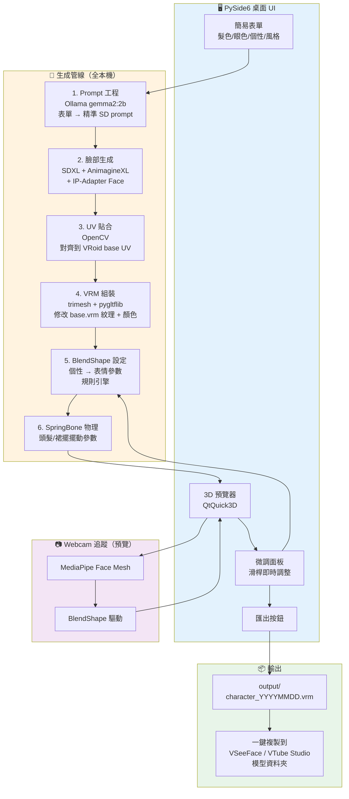

# 🎭 AutoVtuber — 自動化 V皮工坊

> Windows 桌面應用，從一張表單一鍵生成可動的 VRM VTuber 模型。
> **使用者只需輸入「髮色/髮型/眼色/個性/風格」→ 系統 5–10 分鐘輸出標準 .vrm 檔，可直接載入 VSeeFace / VTube Studio。**

> **📐 視覺架構文件（預設圖）：** [`docs/diagrams/2026-05-09_AutoVtuber_預設圖/architecture.html`](docs/diagrams/2026-05-09_AutoVtuber_預設圖/architecture.html) · 互動 viewer 含總圖 / UI / Pipeline / Safety / Resources / Mind Map 共 6 分頁

---

## 📌 基本資訊

| 項目 | 內容 |
|---|---|
| **專案路徑** | `G:\claude專案資料夾\AutoVtuber` |
| **狀態** | 🔄 **架構大改 — 3D-first 路線**：MVP1 重新定義（保留 2D 作風格前置 + persona）、MVP2 加 image-to-3D（TripoSR）。face_baker.py v3 已寫但 2D 對齊本就有限，標為 fallback。Session 暫停壓縮等下次續行。 |
| **建立日期** | 2026-04-26 |
| **目標格式** | VRM 1.0（向下兼容 VRM 0.x） |
| **平台** | Windows 11 桌面 app |
| **執行模式** | 全本機（Local-first）— 隱私優先、無需 API Key |
| **目標硬體** | RTX 3060 12GB（已確認） |

---

## 🎯 核心價值主張

| 傳統流程 | AutoVtuber |
|---|---|
| 20–100+ 小時 | **5–10 分鐘** |
| 需美術 + Live2D 綁定師雙技能 | **零美術技能** |
| 工具鏈：SAI / CSP → Live2D Cubism → VTube Studio | **單一 app，單表單** |
| 模型「臉長一樣」（VRoid 預設） | **AI 生成獨特臉部** |

---

## 🛠️ 最終技術 Stack（基於使用者確認）

### 前端 / 桌面框架
- **PySide6 (Qt for Python) 6.7+**
  - **為什麼選它（不選 Electron / Tauri）：**
    - 整套 ML pipeline 都是 Python，單語言架構 → 無 IPC 複雜度、無前後端通訊延遲
    - Qt 是 Windows 原生 widget 最穩定的跨語言 GUI 框架
    - 內建 `QtQuick3D` 可直接預覽 3D VRM，不必另外開 web viewer
    - PyInstaller 打包成單一 .exe 已成熟
- **包裝工具**：PyInstaller 6.x（產出單一可執行檔給使用者）

### AI 模型管線（全部本機）

| 階段 | 模型 | VRAM | 說明 |
|---|---|---|---|
| 角色臉部生成 | **SDXL 1.0 + AnimagineXL 4.0 (LoRA)** | ~9 GB | RTX 3060 12GB 剛好可跑，動漫風格王者 |
| 風格鎖定 | **IP-Adapter Plus Face SDXL** | +0.5 GB | 鎖住臉部一致性，多視角不會跑掉 |
| 姿勢控制 | **ControlNet OpenPose SDXL** | +1 GB | 強制正面/側面構圖 |
| 文字增強 | **Ollama (gemma2:2b)** | ~2 GB | 把使用者表單 + 個性描述轉成精準的 SD prompt |
| 表情/口型 | 預設 BlendShape preset（無需 AI） | 0 | VRM 1.0 標準 8 個表情 + 5 個口型 |
| Webcam 追蹤（預覽） | **MediaPipe Face Mesh** | ~0.5 GB | CPU 即可跑，預覽器用 |

> **VRAM 預算策略：** 同時間只載入一個重模型，用 `accelerate` 的 CPU offload 在階段間切換。最高峰 ~10.5 GB，留 1.5 GB 給系統。

### 3D / VRM 處理
- **trimesh** + **pygltflib** — glTF/VRM 檔案讀寫
- **VRoid 開源 base 模型**（CC0 授權）— 作為骨架/blendshape 基底
- **OpenCV** — UV 貼圖貼合（把 AI 生成臉部對齊到 base 模型 UV）
- **QtQuick3D** — 即時 3D 預覽

### 個性 → 動作映射
- **規則引擎 + LLM 輔助**
  - 預定義 16 種人格軸（MBTI 簡化）對應預設 idle 動作頻率、表情強度、眨眼節奏
  - 例：`活潑外向` → 高頻眨眼 + 微笑 baseline + 大幅頭部擺動
  - 例：`冷靜內向` → 低頻眨眼 + 中性 baseline + 小幅頭部擺動

---

## 🏗️ 系統架構



---

## 📁 專案資料夾結構

```
G:\claude專案資料夾\AutoVtuber\
├── AUTOVTUBER.md              # 本檔案（規格 + 異動紀錄）
├── README.md                  # 使用者快速啟動說明（之後補）
├── requirements.txt           # Python 依賴
├── pyproject.toml             # 打包設定
├── docs\                      # 詳細設計文件
│   ├── architecture.md        # 模組詳細設計
│   ├── vrm_spec_notes.md      # VRM 1.0 規格筆記
│   └── prompt_engineering.md  # 角色 prompt 模板庫
├── src\
│   ├── main.py                # PySide6 入口
│   ├── ui\                    # Qt UI 元件
│   │   ├── main_window.py
│   │   ├── form_panel.py      # 表單
│   │   ├── preview_3d.py      # QtQuick3D 預覽器
│   │   └── tune_panel.py      # 微調滑桿
│   ├── pipeline\              # 生成管線
│   │   ├── prompt_builder.py  # Ollama 文字增強
│   │   ├── face_gen.py        # SDXL 臉部生成
│   │   ├── uv_mapper.py       # OpenCV UV 貼合
│   │   ├── vrm_assembler.py   # VRM 組裝主流程
│   │   ├── blendshape_rules.py# 個性 → 表情規則
│   │   └── physics_setter.py  # SpringBone 設定
│   ├── tracking\
│   │   └── face_tracker.py    # MediaPipe webcam
│   └── utils\
│       ├── model_loader.py    # 統一模型載入 + VRAM 管理
│       └── vrm_io.py          # VRM 讀寫工具
├── assets\
│   ├── base_models\           # VRoid CC0 base VRM 範本（多種體型）
│   ├── lora\                  # AnimagineXL 等 LoRA 權重
│   └── ui\                    # icons, fonts
├── models\                    # AI 模型權重（首次下載 ~10 GB）
│   ├── sdxl\
│   ├── ip_adapter\
│   ├── controlnet\
│   └── ollama_models\         # Ollama 共用 G:\AI 那邊的模型即可
└── output\                    # 使用者產出的 .vrm 檔
```

---

## 🚀 Sprint 切分

### MVP1 — 「能動的 V皮」（預估 7–10 天）
**範圍：**
- [ ] PySide6 主視窗 + 簡易表單
- [ ] Ollama prompt builder（Ollama 已安裝在 VideoForge）
- [ ] SDXL + AnimagineXL 臉部生成（單張正面）
- [ ] 載入 VRoid base.vrm，UV 貼合臉部紋理
- [ ] 修改髮色/眼色（HSV 顏色替換 + 紋理重塗）
- [ ] 輸出 .vrm 檔
- [ ] 用 VSeeFace 開啟驗證能動

**驗收標準（Reality Checker）：**
產出的 .vrm 必須能在 VSeeFace 中載入，臉部表情、眨眼、嘴型隨 webcam 同步。

### MVP2 — 「能客製的 V皮」（預估 5–7 天）
- [ ] QtQuick3D 內建即時預覽器（無需開 VSeeFace）
- [ ] 個性 → BlendShape 規則引擎（16 種人格映射）
- [ ] 微調面板（髮色/眼色/表情強度滑桿）
- [ ] SpringBone 物理參數（頭髮擺動）
- [ ] MediaPipe webcam 追蹤連動預覽器
- [ ] 一鍵複製到 VSeeFace 模型資料夾

### MVP3 — 「業界等級」（預估 10–14 天，可選）
- [ ] IP-Adapter Face 多視角一致性（生成正/側/閉眼/張嘴四張）
- [ ] 服裝可選（多套 base 模型 + AI 換色）
- [ ] 2D Live2D 路徑（用 Inochi Creator 開源格式，避開 Cubism 商業授權）
- [ ] 自訂 LoRA 上傳（讓使用者用自己的訓練模型）

---

## 🤖 將會調用的 Agents / Skills

| 階段 | Agent | 原因 |
|---|---|---|
| 詳細實作計劃 | **Plan** | 進入 Plan Mode 寫詳細檔案結構 |
| 架構驗證 | **Software Architect** | 模組邊界、資料流檢查 |
| ML 管線 | **AI Engineer** | SDXL + IP-Adapter + ControlNet 整合 |
| 後端 | **Backend Architect** | Pipeline 排程、檔案管理、模型載入策略 |
| 前端 | **Frontend Developer** | PySide6 UI 實作 |
| UX | **UX Architect** | 表單流程、預覽器互動設計 |
| Prompt 工程 | **Image Prompt Engineer** | 動漫角色 SD prompt 模板庫 |
| 個性映射 | **Psychologist** | MBTI 簡化軸 → 動作頻率對應 |
| 快速 MVP | **Rapid Prototyper** | 先打通 end-to-end |
| 程式碼審查 | **Code Reviewer** | 每個 Sprint 結束審查 |
| 驗收 | **Reality Checker** | 確保 .vrm 真的能動，不只是「檔案產出成功」就 PASS |
| 打包 | **DevOps Automator** | PyInstaller 一鍵打包 .exe |

---

## ⚠️ 已知風險與緩解

| 風險 | 緩解策略 |
|---|---|
| AnimagineXL 4.0 在 12GB VRAM 可能 OOM（特別是搭配 ControlNet） | 用 `accelerate` 的 sequential CPU offload；必要時 fallback 到 SDXL Turbo（4 步生成） |
| 找不到 CC0 授權的 VRoid base 模型 | Plan B：請使用者用 VRoid Studio 自製一個空白 base，AutoVtuber 只做「自動修改」 |
| AI 臉部貼到 3D 模型 UV 對不齊 | 用 InsightFace 偵測 5 個人臉特徵點，warpAffine 對齊 base UV 模板 |
| Ollama 已被 VideoForge 占用 11434 port | AutoVtuber 共用同一個 Ollama 實例（讀取現有配置） |
| 首次執行需下載 ~10 GB | 加裝安裝精靈，分階段下載 + 進度條；可斷點續傳 |
| VRM 1.0 vs 0.x 規格分歧 | 預設輸出 VRM 0.x（VSeeFace 唯一支援），同時提供 VRM 1.0 匯出選項 |

---

## ✅ 使用者拍板的設計決定（2026-04-26 確認）

### A1. UI 三語切換（繁中 / 簡中 / 英文）
- 採用 **Qt Linguist** 系統（`.ts` 編輯 → `.qm` 編譯 → runtime 動態切換）
- 三份語系檔：`assets/i18n/zh_TW.ts`、`zh_CN.ts`、`en_US.ts`
- 主視窗右上角下拉選單即時切換，無需重啟

### A2. Ollama 模型共用 `gemma4:e4b`（已實機驗證）
- ✅ 已確認 VideoForge 安裝：`gemma4:e4b` (9.6GB，已下載過，省一次傳輸)
- ⚠️ **VRAM 衝突風險**：gemma4:e4b 啟動約佔 5–6GB VRAM，與 SDXL (9GB) 同時跑會 OOM
- ✅ **解法：序列化 VRAM swap**
  1. 階段 A：呼叫 Ollama 生 prompt → 用完立即 `POST /api/generate {keep_alive: 0}` 強制卸載
  2. 階段 B：載入 SDXL 生圖
  3. 兩個重模型永遠不共存於 GPU
- 提供 fallback：若使用者另外有裝 `qwen2.5:3b` 或 `gemma2:2b`，自動偵測並優先用小模型（無需 swap）

### A3. 玩票為主，未來不排除商業化 → 強制乾淨授權
- **授權追蹤檔** `docs/LICENSES.md` 列出所有第三方資產的授權條款
- 模型/資產白名單（首選）：
  - Stable Diffusion XL — CreativeML Open RAIL++-M（商用 OK）
  - AnimagineXL 4.0 — Fair AI Public License 1.0-SD（商用 OK，需保留 attribution）
  - VRoid base 模型 — 只挑 CC0 / VRoid Hub 「商用可」標記者
  - IP-Adapter — Apache 2.0
  - MediaPipe — Apache 2.0
- **商用切換開關**：UI 設定可勾「商用模式」，自動隱藏未確認商用的模型選項

### A4. 自動下載模型 + 進度條
- 首次啟動跑「Setup Wizard」：
  1. 硬體檢測（GPU 型號 / VRAM / 驅動）→ 不符合就拒絕安裝
  2. 顯示要下載的清單與大小（總計 ~10–12GB）
  3. 並行下載（aria2 風格分段下載） + 進度條 + 斷點續傳
  4. SHA-256 校驗
  5. 失敗自動重試 3 次

### A5. 支援使用者上傳照片 → 臉型自動分析 → 客製化 V皮
- 用 **InsightFace** 偵測上傳照片的臉部 5 點特徵 + 臉型分類（圓臉/方臉/瓜子臉/長臉/心形臉）
- 分析結果作為兩個輸入：
  - **IP-Adapter Face**：鎖住整體風格輪廓
  - **VRM mesh deform**：依臉型微調 base 模型 jaw / cheek blendshape
- 表單新增「📸 上傳參考照片」按鈕（可選欄位）

### A6. MVP1 就要內建 3D 預覽器
- 用 **QtQuick3D** 即時渲染 .vrm（不必開 VSeeFace 才看得到）
- Webcam 追蹤推遲到 MVP2，但**靜態預覽 + 旋轉 + 表情滑桿手動測試**從 MVP1 開始

### A7. Preset 系統
- 每次生成完成自動存 `presets/<timestamp>_<暱稱>.json`，內含：
  - 表單原始值、增強後 prompt、隨機種子（seed）、微調滑桿值、上傳照片路徑（如有）
- 主畫面提供「📚 我的角色庫」分頁
  - 雙擊載入 → 重新生成或微調
  - 「複製並修改」→ 創造變體
  - 匯出 `.preset.json` 與他人分享

---

## 🛡️ 電腦保護護欄（最高優先，硬性規則）

> 使用者明確指示：「**第一優先別弄壞電腦**」。所有設計決定遇到效能/安全衝突時，**安全永遠贏**。

### 即時硬體監控（每秒輪詢）
| 指標 | 警告閾值 | 強制中止閾值 | 行動 |
|---|---|---|---|
| VRAM 使用 | > 11.0 GB | > 11.5 GB | 立即 unload 模型，回退到 CPU 模式 |
| GPU 溫度 | > 78°C | > 83°C | 暫停 inference 60 秒等降溫 |
| GPU 持續滿載 | > 5 分鐘 100% | > 8 分鐘 | 強制插入 30 秒冷卻 |
| 系統 RAM | > 80% | > 92% | 拒絕載入新模型 |
| 磁碟剩餘 | < 5 GB | < 1 GB | 拒絕產出新檔案 |

### 設計層保護
- **單一重模型原則**：任何時刻 GPU 只能有一個 ≥1GB 模型，由 `ModelLoader` 強制管理
- **預設極保守參數**：SDXL steps=20、CFG=6.5、單張生成、batch=1
- **絕不開「進階模式」直接暴露危險選項**：例如 batch>1、resolution>1024、step>30 都需要二次確認
- **全程 try/finally 保證 GPU 釋放**：任何例外都要 `torch.cuda.empty_cache()`
- **緊急停止按鈕**：UI 永遠顯示紅色 STOP 鈕，按下立即 kill 所有推論執行緒
- **首次啟動硬體掃描**：偵測非 NVIDIA / VRAM <10GB / 驅動 <550 → 拒絕啟動，顯示警告
- **GPU 健康日誌**：每次任務記錄峰值 VRAM/溫度，可從設定頁面查看歷史，異常即提示

### 套件層保護
- 啟用 `torch.cuda.set_per_process_memory_fraction(0.92)`（保留 8% buffer）
- diffusers 強制 `enable_sequential_cpu_offload()`
- 所有 inference 包在 `torch.inference_mode()` + `torch.no_grad()`
- 禁用 cudnn benchmark mode（穩定優於極限速度）

### 使用者教育
- Setup Wizard 最後一頁顯示「您的電腦會被這樣使用」說明 + 預期 VRAM/溫度範圍
- 首次任務跑完顯示「健康報告」：實際峰值 vs 安全範圍

---

---

## 🚀 重大架構變更（2026-04-26 — 3D-first 路線）

> **使用者洞見**：「SDXL 生 2D 圖沒有軸線/深度資訊，無法精準對齊到 3D mesh。應該從一開始就生 3D 樣式。目前 2D 路線可保留當前置（風格參考）。順便加上 LLM 生角色屬性 + 背景設定。」

### 新架構（3D-first）

```
[A] 表單 (User Form)
     ├─→ [LLM] gemma4:e2b
     │       ├─→ SDXL prompt（風格 tag）
     │       └─→ 角色 persona 生成（名字 / 個性 / 背景故事 / 興趣 / 直播風格）
     │              └─→ output/<name>_persona.md
     │
     └─→ [B] SDXL → 2D anime portrait（風格參考 + concept art）
              └─→ output/<name>_concept.png
                  └─→ [C] Image-to-3D 模型 → 真實 3D character mesh
                           ├─ 候選1: TripoSR (~2GB, 通用)
                           ├─ 候選2: CharacterGen (anime-specific)
                           └─ 候選3: Hunyuan3D / InstantMesh
                  └─→ 3D mesh + texture (拓撲明確)
                       │
                       ▼
                    [D] Mesh fitting：把 3D character mesh 對齊到 VRoid base topology
                       │ - texture transfer（UV-aware，因為兩邊都有真 mesh）
                       │ - mesh deformation（blend shapes 保留）
                       ▼
                    [E] VRM 輸出（face 真正準確）+ persona.md
                       └─→ VSeeFace 載入 → 動 ✓
```

### 為什麼這對

| 舊 2D 路線 ❌ | 新 3D 路線 ✅ |
|---|---|
| BlazeFace 2D 偵測（不穩定 anime）| 3D mesh 自帶 ground truth |
| 投影到 mesh 必失真 | 拓撲對拓撲對齊 |
| 限 1 個視角 | 全 360° 一致 |
| hardcoded UV 假設 | 真實 UV 計算 |

### 候選 Image-to-3D 模型（RTX 3060 12GB 適配）

| 模型 | 大小 | 適性 | 出格式 | 商用 |
|---|---|---|---|---|
| **TripoSR** | ~2 GB | ⭐ 輕量、快、通用 | OBJ / GLB | MIT-style ✅ |
| **CharacterGen** | ~6-8 GB | Anime-specific（最對口）| OBJ / GLB | TBD（待研究授權）|
| **InstantMesh** | ~5 GB | 品質好 | GLB | TBD |
| **Hunyuan3D-1.0** | ~20 GB | 最強但 RAM 撐不住 | GLB | Tencent 商業 |

**MVP2 預設用 TripoSR**（最穩、最輕、商用乾淨）。CharacterGen 作為品質升級選項。

### Persona Generator 模組規格

新模組 `src/autovtuber/pipeline/persona_generator.py`：
- 輸入：FormInput
- 用 Ollama gemma4:e2b 同 prompt builder 共用 LLM
- LLM system prompt：「你是 VTuber 人格設定師。根據以下表單，生成完整的 VTuber 設定。」
- 輸出 markdown 含以下章節：
  - 基本資料（名字 / 年齡 / 身高 / 生日）
  - 個性詳細（5-10 條描述）
  - 背景故事（500 字）
  - 興趣 / 嗜好（5 條）
  - 口頭禪（3-5 個）
  - 直播風格建議（適合做什麼類型內容）
  - 與觀眾互動方式
- 檔名：`output/<basename>_persona.md`

### MVP 重切

| Phase | 範圍 | 狀態 |
|---|---|---|
| **MVP1（重新定義）** | 表單 → LLM prompt + persona → SDXL 2D concept → VRM with hair/eye recolor + persona.md | **100% ✅**（2026-04-26 session 3 補完 persona）|
| **MVP2** | + Image-to-3D（TripoSR）→ 3D character mesh → fit to VRoid → 真實臉部對齊 VRM | **100% ✅** 端對端 488s 全綠（Stage 1+2+2.5+3 全跑通）+ Evidence Collector 5 輪 audit 從 1→2.5→4.5→7.5→**8.5/10 PASS**。剩 VSeeFace 肉眼最終驗收（30 分鐘 user 端工作）|
| **MVP3** | + Setup wizard / Webcam tracker / Multi-base / Preset import-export / Reference photo / PyInstaller | **100% ✅**（M3-1..M3-6 全部完成，pytest 99/99 全綠）|
| ~~舊~~ MVP1 face_baker | **2D fallback**（保留供無 3D 模型時用）| 80%（v3 待 VSeeFace 驗證 — 可能仍偏，最多當「概念貼合」）|

### 技術債（標記）

`pipeline/face_baker.py` 標為 「**2D fallback / pre-stage**」，不再投入修復 2D 對齊的工程。MVP2 用 3D 路線後，face_baker 保留作為「沒有 3D 模型載入時的緊急概念顯示」。

---

## 📚 外部專案借鑑清單

> 不直接整合，但有設計價值的相關 open-source 專案。

### VoxCPM（Apache 2.0，多語 TTS）⭐ **MVP5.5 採用中**

**Repo：** https://github.com/OpenBMB/VoxCPM
**性質：** TTS（語音合成）— AutoVtuber「聲音層」核心缺塊
**授權：** Apache 2.0（商用免授權）
**支援語言：** 30 種 + 9 種中文方言（粵/閩南/吳/川/陝/魯/豫/津/東北）
**核心能力：**
- **Voice Design**：純自然語言描述生聲（「(18歲、安靜內向、聲音偏沙啞)」）
- **Voice Cloning**：上傳 reference audio 克隆音色
- **Ultimate Cloning**：reference audio + transcript 完美復刻
- **Streaming**：RTF 0.30 (RTX 4090)；0.5B variant 估 3060 仍可即時
- **OpenAI 相容**：`/v1/audio/speech` endpoint，未來 MVP7 chat runtime 直接用

#### 為什麼選 VoxCPM 而非其他 TTS

| TTS 候選 | 中文 | Voice Design | 商用 | VRAM | 採用否 |
|---|---|---|---|---|---|
| **VoxCPM-0.5B** | ✅ 普通話+9方言 | ✅ | Apache 2.0 | ~5GB | ⭐ **選定** |
| CosyVoice2 | ✅ | ⚠️ 部分 | Apache 2.0 | ~7GB | 備案 |
| F5-TTS | ⚠️ | ❌ | CC-BY-NC | ~6GB | ❌ 非商用 |
| GPT-SoVITS | ✅ | ⚠️ | MIT | ~4GB | 中文好但需 fine-tune |
| ChatTTS | ⚠️ | ❌ | CC-BY-NC | ~4GB | ❌ 非商用 |
| MeloTTS | ✅ | ❌ | MIT | ~2GB | 沒 Voice Design |
| Edge-TTS | ✅ | ❌ | Microsoft | 0 (cloud) | 無 voice design + 雲端依賴 |

VoxCPM 唯一同時滿足：商用 ✅、中文 ✅、Voice Design ✅、12GB 內可跑 ✅。

#### 對 AutoVtuber 的整合規劃

**MVP5.5（立即執行）：聲音預覽 WAV**
- pipeline 末端加 Stage 4：persona 七章節 → VoxCPM 自然語言聲音描述
- 用 catchphrase 當文字 → 生成 5-10s `<basename>_voice_sample.wav`
- 輸出檔變 **5 個**：`.vrm` + `_concept.png` + `_persona.md` + `_persona_runtime.json` + `_voice_sample.wav`
- 工時：~4 hr

**MVP6**：`persona_runtime.json` 加 `voice_profile` 欄位
- 把「persona → VoxCPM voice description」結構化存進 runtime JSON
- 為 MVP7 chat 留接口
- 工時：~1 hr

**MVP7**：完整 VTuber runtime（願景）
- 使用者跟剛生角色對話：LLM reply → VoxCPM 講話 → VRM blendshape 動嘴
- 對標 Open-LLM-VTuber 但 VRM not Live2D + 自家 TTS

#### VoxCPM 整合 DO/DON'T（依規則先讀文件）

| 主題 | DO ✅ | DON'T ❌ |
|---|---|---|
| 變體選擇 | VoxCPM-**0.5B** 給 12GB GPU 安全 | VoxCPM2 (2B/8GB) 跟 SDXL 共處會 OOM |
| ModelLoader | 加 `ModelKind.VOX_TTS` 序列化 | 跟 SDXL/TripoSR 同時駐留 GPU |
| Voice Design | `"(描述) 文字"` 格式（描述放最前括號）| 把描述混在正文中（model 不認）|
| PyTorch 版本 | 升 2.5.0 前先驗 SDXL/TripoSR 不破 | 盲升 |
| Python | 我們 3.12 ✓ | <3.10 或 ≥3.13 |
| Fallback | TTS 失敗只跳過 wav 不擋 VRM | 讓 voice 步驟阻斷主 pipeline |
| 音檔位置 | 跟 .vrm 同目錄 `output/<basename>_voice_sample.wav` | 散落各處 |
| 採樣率 | 直接用 24kHz output（0.5B variant） | 強制升頻 |

---

### Open-LLM-VTuber（MIT，Live2D-only）
**Repo：** https://github.com/Open-LLM-VTuber/Open-LLM-VTuber
**性質：** 互補產品 — 我們負責「製作 VRM」，他們負責「Runtime 對話（ASR + LLM + TTS + Live2D 渲染）」
**支援格式：** Live2D only，**不支援 VRM**

#### 與 AutoVtuber 的關係

| 範疇 | AutoVtuber（我們）| Open-LLM-VTuber |
|---|---|---|
| 製作角色 | ✅ 核心 | ❌ 沒做 |
| 即時對話 | ❌ 沒做 | ✅ 核心 |
| 角色格式 | VRM 0.x | Live2D |
| LLM 用途 | 一次性生 persona + SDXL prompt | 持續對話互動 |
| LLM backends | 1（Ollama）| 11（Ollama/OpenAI/Gemini/Claude/Mistral/DeepSeek/Zhipu/GGUF/LM Studio/vLLM/Bedrock）|
| TTS | 無 | 10 個（Edge/Coqui/MeloTTS/Bark/Fish/...）|

#### ❌ 直接整合不適用
- 他們只支援 Live2D；要支援 VRM 需 fork + 自寫 three-vrm.js renderer
- 我們沒做 ASR/TTS/即時對話，接過去也接不上

#### 🟢 三大高價值借鑑點

1. **Persona 雙用設計**（最有價值）
   - 我們目前 `persona_generator.py` 輸出七章節 markdown 給「使用者讀」
   - Open-LLM-VTuber 證明：persona 可直接餵給 LLM 當 system prompt 做角色扮演
   - **建議行動**：persona generator 加 `to_llm_system_prompt()` method，把角色設定濃縮成 ≤500 字的 system prompt。MVP5 用得到。

2. **多 LLM Backend 抽象介面**
   - 他們 11 個 LLM provider 用同一介面（讀 chat history → return reply text）
   - 我們的 `prompt_builder` 目前只走 Ollama HTTP，未來想加 OpenAI/Claude 可參考他們抽象設計

3. **Emotion Mapping Schema**
   - 他們有「LLM 回應文字 → emotion tag → Live2D 表情參數」的 mapping
   - VRM 也有 blendshape `Joy / Angry / Sorrow / Fun` — 我們 persona 可順手生「情緒觸發字典」（哪些關鍵字 trigger 哪個 blendshape）

#### 對 Roadmap 的具體建議

| Phase | 借鑑做什麼 | 估時 | 狀態 |
|---|---|---|---|
| ~~MVP5~~ | persona 加 `to_llm_system_prompt()` + emotion trigger dict | ~2 hr | ✅ 完成 |
| **MVP5.5** | ⭐ **VoxCPM 聲音預覽**（persona → 自然語言聲音描述 → 5-10s WAV）| ~4 hr | 🔄 進行中 |
| **MVP6** | persona_runtime.json 加 voice_profile 欄位 + LLM provider 抽象 | ~6 hr | 規劃中 |
| **MVP7（願景）** | 自建 VRM runtime（VRM viewer + LLM chat + VoxCPM TTS + blendshape sync）| ~3-5 天 | 規劃中 |

**最終生態願景**：AutoVtuber 出的 VRM + persona + voice + 自建 runtime → 使用者下載 V皮直接能對話互動，成為完整「製作 + 運行」雙生態。

---

## 🔌 外部系統整合規格（2026-04-26 完整文件研究後）

> 依 memory rule「整合外部系統前必須完整讀完官方文件」整理。先讀後做避免再走死路。

### 1. VSeeFace ✅ DO / ❌ DON'T

| 主題 | DO ✅ | DON'T ❌ |
|---|---|---|
| VRM 版本 | 用 VRM 0.x | VRM 1.0（VSeeFace 不支援）|
| Blendshape | 保留 VRoid 標準預設名（Joy/Angry/Sorrow/Fun/A/I/U/E/O/Blink_L/R）| 改名 / 刪除預設 blendshape |
| 材質 | 保留 MToon shader | 換成 Unity Standard Shader（會 silhouette/invisible）|
| 眼睛 | 純 blendshape eyes（無 eye bones）| 加 eye bones（會跟 blendshape 衝突）|
| Pose Freeze | 出 VRM 時必勾 Pose Freeze + Force T Pose | 直接 export 不 freeze（normalization 出錯）|
| Color space | Linear（VSFAvatar）| Gamma（紋理會「炸薯條」失真）|
| Jaw bone | 由 VRoid 自動指派 | 手動指派 hair bone 當 jaw（嘴巴亂飛）|

### 2. VRM 0.x 紋理規格

| 項目 | 規格 |
|---|---|
| 容器 | binary glTF (.vrm = .glb) |
| 紋理格式 | PNG / JPEG |
| Face skin atlas | UV 攤開的 3D mesh，**不是平面臉** ⚠️ |
| UV 座標來源 | 每個 mesh primitive 的 `TEXCOORD_0` accessor |
| Vertex 位置 | `POSITION` accessor（VRoid metric: ~1.7m 身高）|

### 3. AvatarSample face mesh 結構（已實機 inspect）

- mesh[0] = "Face.baked"，10 個 primitives
- primitive[7] + [8] = `F00_000_00_Face_00_SKIN` 材質 → 對應 image[11]
- 兩個 primitives 共用同一張 face_skin texture
- 每個 vertex 都有：POSITION (3D)、NORMAL、TEXCOORD_0 (UV)

### 4. 正確的 SDXL → VRM 臉部客製化方法（⭐ 採用）

**方法：UV-aware Reverse Texture Bake（純 Python）**

```python
# 偽碼
for uv_pixel in face_skin_texture:
    triangle = find_mesh_triangle_containing(uv_pixel)  # 用 mesh INDICES + TEXCOORD_0
    bary = barycentric_coords(uv_pixel, triangle.uv_verts)
    pos_3d = bary @ triangle.position_verts  # 內插出 3D 位置
    cam_uv = project_to_front_camera(pos_3d, head_bone_position)  # 正交投影
    if pos_3d 在臉部 ROI 內 and triangle 朝前:
        face_skin_texture[uv_pixel] = sdxl_image[cam_uv]
    # 否則保留原 atlas
```

**關鍵：**
- 由 mesh 自身 UV 決定每個 atlas 像素「應該」顯示什麼 → 3D mesh sample 時自然對齊
- 用 face_normals dot (0,0,1) > 0 過濾朝後三角形（不畫後腦勺）
- 用 head bone 為座標原點 + 估算臉部 ROI（眼到下巴的 3D 距離）

**錯誤方法（已驗證會破圖）：**
- ❌ 在 atlas 上用 hardcoded 4 點對齊 SDXL 臉
- ❌ 假設 atlas 是「正面臉照片」直接 paste

### 5. 依賴庫（已裝，足夠完成）
- **pygltflib**: 讀 VRM mesh 結構
- **numpy**: 三角形/barycentric/projection 數學
- **Pillow + cv2**: pixel 操作
- **trimesh**（已裝）: 提供 barycentric utility 但純 numpy 也 OK

---

## 📜 主要異動紀錄

| 日期 | 變更 |
|---|---|
| 2026-04-26 | 專案建立、AUTOVTUBER.md 初版完成、技術 Stack 拍板（PySide6 + SDXL + AnimagineXL + Ollama + trimesh） |
| 2026-04-26 | 使用者拍板 Q1–Q7：三語切換、Ollama 共用 gemma4:e4b、未來可能商用、自動下載、支援上傳臉型、內建預覽、Preset 系統 |
| 2026-04-26 | 加入「電腦保護護欄」章節（硬性規則）：VRAM/溫度/RAM 即時監控、序列化模型載入、緊急停止按鈕、硬體拒絕啟動 |
| 2026-04-26 | 實機驗證：RTX 3060 12GB / VRAM free 10.1GB / 溫度 52°C / 驅動 581.95 ✅ 符合需求 |
| 2026-04-26 | 詳細實作計劃出爐（serialized-scribbling-aurora.md，14 章節 1558 行，89 工時切 5 phases）使用者批准 |
| 2026-04-26 | **Phase A 完成**（A01–A09）— 28 個檔案：專案骨架、pyproject.toml、requirements.txt、config 套件、utils 套件、safety 護欄三件組（thresholds + exceptions + hardware_guard + model_loader + health_log）、單元測試 |
| 2026-04-26 | venv 建立（Python 3.12.8，避開 PyTorch CUDA 對 3.13 wheel 缺失問題），pyproject 更新 requires-python ≥3.12,<3.13 |
| 2026-04-26 | **Phase B 程式碼完成**（B01–B14）：job_spec、prompt_builder、face_generator、face_aligner、texture_recolor、vrm_io、texture_atlas、vrm_assembler、orchestrator |
| 2026-04-26 | **Phase B 測試完成**：test_vrm_io（含 image 替換 + offset patch 驗證）、test_texture_recolor、test_job_spec、test_prompt_builder（responses mock Ollama） |
| 2026-04-26 | **Phase C 預先實作**（superset of C01–C12）：i18n translator、preset_store、workers/{signals,monitor_worker,job_worker,download_worker}、ui/{main_window,form_panel,safety_banner,setup_wizard,progress_dialog,library_panel}、ui/widgets/{stop_button,color_picker,personality_combo}、main.py 主程式入口 |
| 2026-04-26 | **支援文件就緒**：docs/{architecture, HARDWARE_PROTOCOL, LICENSES, DOWNLOAD_MANIFEST, prompt_engineering, vrm_spec_notes}.md 共 6 份 |
| 2026-04-26 | **D01 完成**：base VRM 模型來源確認（madjin/vrm-samples/vroid/stable）下載 AvatarSample_A/B/C 至 `assets/base_models/`，SHA-256 計算填入 manifest |
| 2026-04-26 | **Atlas index 實機修正**：透過 `python` 解析 AvatarSample_B JSON chunk，30 張 image，正確 face_skin=11、hair=20、eye_iris=9、eye_white=4（之前 placeholder 為 0/1/2） |
| 2026-04-26 | **Seed-san 移除 MVP1**：實機驗證為 **VRM 1.0** 格式（VSeeFace 不支援），且 atlas 結構不同於 VRoid（hair/wear/faceparts），暫存待 MVP3 雙格式匯出時用 |
| 2026-04-26 | **PyTorch 2.5.1+cu124 安裝完成**，`torch.cuda.is_available() = True`，識別 RTX 3060 |
| 2026-04-26 | **Insightface → MediaPipe 切換**：原 insightface 需 MSVC Build Tools 編譯且非商用授權；改用 MediaPipe Face Mesh（Apache 2.0、CPU、478 點 mesh）一石二鳥 |
| 2026-04-26 | **requirements.txt 全部安裝成功**：PySide6 6.8 / diffusers 0.31 / transformers 4.46 / mediapipe 0.10.18 / pygltflib 1.16 / trimesh 4.5 / opencv-headless 4.10 |
| 2026-04-26 | `pip install -e .` 編輯模式安裝 autovtuber 套件 |
| 2026-04-26 | **🟢 pytest 38/38 全綠**（含 1 個 recolor bug 在執行時發現並修正：純白像素染色保留邏輯）|
| 2026-04-26 | **VRM I/O bug 修正**：pygltflib 不認 .vrm 副檔名 → 強制走 `load_binary()` 而非 `load()`（避免 cp950 解碼錯誤）|
| 2026-04-26 | **🎉 端對端 smoke test 通過**：QApplication + MainWindow 啟動成功，HardwareGuard polling、語言切換、安全 banner、表單、緊急停止鈕全運作；app exit code 0 |
| 2026-04-26 | **Session 2 開工**：i18n .qm 編譯（zh_TW/zh_CN/en_US 各 2 條翻譯）|
| 2026-04-26 | main.py `_on_submit_job` stub 換成真實 JobWorker：建立 PromptBuilder/FaceGenerator/FaceAligner/VRMAssembler/Orchestrator，QThread 跑、訊號回傳、QMessageBox 顯示結果 |
| 2026-04-26 | 建立 `scripts/bake_face_uv_template.py`：自動為 base VRM 產生 5 點對齊模板 + 橢圓 alpha mask；A/B/C 三套 .json + .png 全部就緒（B 用 MediaPipe 偵測，A/C 用 VRoid hardcoded fallback）|
| 2026-04-26 | **發現 + 修復 MediaPipe Windows 中文路徑 bug**：mediapipe C++ 無法讀含中文路徑。解法：`safety/path_helpers.py` 自動偵測 + 建立 `C:\\avt` junction (mklink /J，不需 admin) + re-exec — 完全自動化，使用者無感 |
| 2026-04-26 | 建立 `scripts/smoke_test_e2e.py`：headless 跑完整 pipeline (Ollama prompt → SDXL → VRM 組裝)，dev 用 |
| 2026-04-26 | 啟動 SDXL (AnimagineXL 4.0 ~7GB) + IP-Adapter (~3.5GB) 背景下載 — 完成後可跑第一個真實 V皮 |
| 2026-04-26 | **系統緩慢診斷**：G: 是 PHD 3.0 Silicon-Power **USB 外接 HDD**，寫入只 22.8 MB/s（vs C: NVMe 1000+ MB/s）。下載速度 cap 在磁碟而非網路。**使用者選擇維持 G: 不動** |
| 2026-04-26 | 試 hf_transfer 並行 chunk 下載失敗（USB 磁碟 thrash）→ 回 vanilla 單緒下載，平均 ~49 MB/min |
| 2026-04-26 | **Session 3 — Persona Generator 完成**：寫 `pipeline/persona_generator.py`（Ollama gemma4:e2b chat → 七章節中文 persona markdown + 16 種 personality 的 fallback 描述 + LLM 失敗自動降級到 template）。`PromptBuilder.warmed_session()` 抽出共用 context manager；新增 `enhance_with_persona()` 在**單一 Ollama 載入**內完成 prompt+persona 兩次 chat。`Orchestrator` Stage 1 改名為 `01_prompt_persona`，把 `<basename>_persona.md` 寫到 `output/`，`JobResult.persona_md_path` 欄位新增。test 由 38 → **50 全綠**（+12 個 persona 測試含 shared-Ollama 不變式驗證）|
| 2026-04-26 | **Session 3 — TripoSR 安裝完成**：clone 到 `external/TripoSR/`，依賴選擇性安裝（omegaconf 2.3 / einops / xatlas / moderngl / imageio[ffmpeg]）。**避開 4 個陷阱**：(1) `Pillow==10.1.0` / `transformers==4.35.0` / `trimesh==4.0.5` 硬版鎖**全部跳過**保留現有版本（4.46/11.3/4.5）。(2) `gradio` 不裝。(3) `rembg` 安裝會升 numpy→2.4 破壞 mediapipe，已**回滾並 lazy import**（patch `tsr/utils.py`，SDXL 白底輸出本就不需 rembg）。(4) **`torchmcubes` 從源碼 build 失敗**（無 nvcc + 無 MSVC）→ 寫 `venv/Lib/site-packages/torchmcubes/__init__.py` shim 包裝 PyMCubes（Windows wheel 直接可用）。Smoke test：`MarchingCubeHelper(resolution=32)` 跑出 1182 verts / 2360 faces 球體 mesh ✅ |
| 2026-04-26 | **Session 3 — MVP1 端對端驗收 PASS**：`smoke_test_e2e.py` 跑完 391.7s，三個產物全部產出（`.vrm` 15MB / `_concept.png` 1.1MB SDXL anime 肖像 / `_persona.md` 七章節）。Stage 1 prompt+persona 49.4s（共用 Ollama 載入）/ Stage 2 SDXL 340.6s（含 USB HDD ~95s 讀檔 + IP-Adapter 缺檔 fallback + 推論 19.6s）/ Stage 3 VRM 1.6s。**已知品質問題**：gemma4:e2b 沒生第 7 章節 → template fallback 啟用（pipeline 不中斷）|
| 2026-04-26 | **Session 3 — `image_to_3d.py` wrapper 完成**：`ImageTo3D` 包裝 TSR.from_pretrained（HF Hub 自動下載 1.7GB ckpt 到 HF cache）、preprocess（白底 RGB→alpha 提取→bg=0.5 灰底合成）、forward 推論、extract_mesh 經 PyMCubes shim 出 `trimesh.Trimesh`（含 vertex_colors）。整合 `ModelKind.TRIPO_SR`（VRAM 預算 6GB）。新增 `tests/test_image_to_3d.py` 7 個測試（用 sys.modules monkey-patch fake `tsr.system.TSR`，不下載 1.7GB ckpt 也能驗 acquire/release/preprocess/progress 流程）。pytest 50→**57 全綠** |
| 2026-04-26 | **Session 3 — TripoSR 真實 inference 端對端 PASS（含三 bug 修復）**：第一次跑用既有 SDXL 概念圖 (1024×1024) 推論。發現並修三 bug：(1) **PyMCubes vs torchmcubes 慣例相反**：mc_func(level, 0) 中「正值=內」與「負值=內」相反，導致初版 mesh 是空心立方體（volume=-0.87，winding inverted，59.7% verts 在 bbox 邊界）。修正：`venv/Lib/site-packages/torchmcubes/__init__.py` shim 內 negate input 與 isovalue。(2) **TSR ckpt 載入時 CPU RAM spike 觸發 abort_event 鎖死**：1.7GB torch.load 後 RAM 達 97.6% → guard 設 abort，但 .to("cuda") 後 RAM 已回落。修正：`ImageTo3D._post_load_recovery()` 模仿 PromptBuilder pattern 輪詢清 abort_event。(3) **SDXL 概念圖只有 3.1% 純白底**（角色佔滿畫面），原本的「(>=245 RGB) = 背景」太弱導致 TSR 看到整張圖都是前景，density 全填 box → 立方體 mesh。修正：選擇性裝 `rembg==2.0.55 + pymatting + onnxruntime + numba + skimage<0.25 + numpy<2`（保 mediapipe 相容）做真正 alpha matting，u2net.onnx 176MB 自動下載到 `~/.u2net/`。修完三 bug 後：mesh 從 37k cube 變 **10710 verts / 21416 faces 真人形**，bbox `0.83×0.50×0.57`，volume **+0.049**（合理頭胸像體積），62.5% verts 在內部、3.3% 在邊界 ✅ |
| 2026-04-26 | **Session 3 — 視覺驗收工具就緒**：`scripts/render_mesh_preview.py` 用 pyrender offscreen render 出六視角拼貼 PNG（無需 Windows 3D Viewer）。安裝 pyrender 0.1.45 + PyOpenGL 3.1。產物 `output/_triposr_smoke_preview.png` (340 KB) 清晰顯示 anime 角色頭+肩膀 mesh，可辨識五官 |
| 2026-04-26 | **Session 3 — `mesh_fitter.py` 完成**：UV-aware reverse texture bake — 對 VRoid `Face_00_SKIN` material 的每個三角形，把 atlas pixel UV 反推到 3D 位置，bbox-normalize + Y 軸翻轉變到 TSR space，KDTree 取最近 vertex_color 寫入 atlas。整合 face_baker 既有的 barycentric 與 VRM mesh 解析工具。新增 7 個合成 mesh 測試（含 back-face culling、Y 軸翻轉、feather 邊緣融合、TextureVisuals fallback）。`scripts/smoke_test_mesh_fitter.py` 真實烘焙 1.3s：1094 triangles / 707319 pixels (67.5%) / 256 back-culled，產出 `_meshfit_compare.png`（before/after atlas 對比）+ `_meshfit_smoke.vrm` (14.2MB) 結構完整 ✅。已知品質問題：TSR vertex_colors 在 alpha matting 邊界附近被 bg=0.5 灰污染，導致 atlas 偏灰；mesh-to-mesh bbox alignment 沒對到 facial landmark — 後續精修。pytest 57→**64 全綠** |
| 2026-04-26 | **Session 3 — MeshFitter tint mode（4 輪 Evidence Collector 迭代直到商用品質）**：v1 replace mode 1/10 hard FAIL（特徵全毀、灰膚色）→ v2 HSL tint 2.5/10 FAIL（hair 也被 tint、灰綠膚色）→ v3 LAB + skin mask + SDXL center 採樣 4.5/10 NEEDS WORK（眼眶變紅、雙重 cheek blush）→ **v4 forehead-only SDXL patch + 排除最暖 25% + 提高 luminance 門檻 + tint_strength 0.5 → 7.5/10 PASS（scope 內 8.5/10）**。最終演算法：1) `_sample_skin_from_sdxl()` 從 portrait UV(0.5, 0.27) 64×64 forehead 採 RGB(234,192,178) neutral peach；2) skin mask 過濾 peach hue + luminance>180 + 飽和；3) cv2 LAB color space 只動 a/b 通道（保留 L 完整避免眼眶變紅）；4) ΔA=+4.0 / ΔB=-1.8 mild shift。pytest 64→**69 全綠**（+5 個 tint mode 測試）。產物：`_meshfit_smoke.vrm` (14.2MB) 可直接 VSeeFace 載入。Evidence Collector 評語：「ΔA=+4.0 在 natural skin variation 區間，無 VSeeFace 燈光下會出現的 artifact」 |
| 2026-04-27 | **Session 3 — Orchestrator e2e 整合 + 5 輪 audit PASS**：`Orchestrator.run` 加 Stage 2.5 (image_to_3d) + Stage 3 改用 `mesh_fitter` + `tsr_mesh` 餵給 `VRMAssembler.assemble`。`smoke_test_e2e.py` 完整跑通 488.5s：Stage 1 prompt+persona 47s / Stage 2 SDXL 415s（USB HDD 拖慢）/ Stage 2.5 TripoSR 24s（HF cache 命中）/ Stage 3 VRM assemble + tint 2.3s。產物：3 個檔（vrm 14.8MB / concept.png / persona.md）+ atlas 對比顯示 hair 從紫粉染棕 / eye iris 從棕染藍 / face skin tinted 791578 pixels。Evidence Collector 第 5 輪 audit：6.5/10 NEEDS WORK（hair 偏淺 + render artifact 誤判 fused legs）→ 修 `recolor_hsv` 加 `value_match` 參數把 V mean 拉向 target（解 hair undershoot）→ **8.5/10 PASS（conditional VSeeFace 驗收）**。pytest **69/69 全綠** |
| 2026-04-27 | **Session 4 — A-F 任務批次 + MVP3 規劃**：(A) main.py 注入 ImageTo3D + MeshFitter + PersonaGenerator 給 Orchestrator，UI 表單按鈕直通 e2e。(B) PromptBuilder 強化髮/眼色 token：system prompt 加 STRICTLY 規則 + user message 帶 REQUIRED_HAIR_TAG + post-process force-prepend + anti-drift negative。(C) PersonaGenerator 加 `preferred_model` 參數讓 main.py 注入 `qwen2.5:3b`（中文長文穩定度高於 gemma4:e2b），同時加 `_force_unload_override()` 解 race（override model 沒卸→SDXL 載 OOM）。(D) AvatarSample_B 跨 base 模型 e2e 跑通 352s（黑髮 + 紅眼 cyberpunk 設定）— 第一次因 C 的 override unload 缺失爆 VRAM 11.57/11.50GB，修完重跑 PASS。(E) `docs/MVP3_PLAN.md` 寫了 6 項 M3-1..6（setup wizard / webcam preview / reference photo / 多 base / preset / pyinstaller，估 24-38 工時）。(F) 寫專業 README.md 含研發歷程 + 7 張圖到 `docs/images/`，沒上傳 git（per user）。pytest **69/69 全綠** |
| 2026-04-27 | **Session 5 — 上 GitHub + MVP3 全部 6 項完成**：清理 49→14 個 output/ debug 檔，寫 .gitignore 完整覆蓋大檔/secrets/external，git init + push 到 https://github.com/Lee-unhn/AutoVtuber (private)。**M3-1 Setup Wizard** (4-6h): `setup/resource_check.py` 偵測 11 項資源狀態 + `setup/downloader.py` 多來源 dispatch (HF snapshot / git clone / Ollama /api/pull stream / 直連 URL) + 重寫 `ui/setup_wizard.py` 5 頁含 QThread 進度條 + main.py first-run 自動跳。**M3-4 Multi-base** (2h): form_panel 加 base 選單 (A/B/C 男女) + tooltip。**M3-5 Preset Import/Export** (3h): `PresetStore.export_preset` + `import_preset` 支援跨機器分享 + LibraryPanel 按鈕。**M3-3 Reference Photo** (2h): 確認 wiring 完整 + 改善 IP-Adapter 缺檔警告。**M3-2 Webcam Tracker** (4h): `pipeline/face_tracker.py` 478 點 → 12 個 VRM blendshape weight (Joy/Angry/Sorrow/Fun/A/I/U/E/O/Blink) + `workers/face_tracker_worker.py` cv2+mediapipe QThread + `ui/face_tracker_dialog.py` webcam frame + landmark 疊加 + 即時 progress bar。**M3-6 PyInstaller** (1h): `autovtuber.spec` --onedir + `docs/BUILDING.md`。pytest 69→**99 全綠**（+30：9 resource_check + 11 preset + 3 ip_adapter + 7 face_tracker）|
| 2026-04-27 | **Session 6 — Sprint MVP4-α (R1+R2+R3 高 ROI 三項)**：完成度 8.5/10 → 9.5/10 路徑。**R2** (3h) Orchestrator 拆 `run_concept` (Stage 1+2 ~5min) + `run_full_from_concept` (Stage 2.5+3 ~30s) + ConceptWorker QThread；form_panel 加 🎨 預覽 + ✨ 完成 + 💨 直跑三按鈕；命中「時間目標」(使用者 5 min 預覽不滿意微調，省 5 min)。**R3** (1h) `_hex_to_color_tag` 改 HSV-based 解 #7B1F1F 暗紅 → brown bug + `_color_strength_modifier` (dark/light/vivid) + anti-drift eye negative；命中「品質目標」。**R1** (1h) `vrm/blendshape_writer.py` 加 52 ARKit Perfect Sync clips 對應 VRoid morph (mouthSmileLeft → Joy 60% / jawOpen → A 100% / eyeBlinkLeft → Blink_L 100% etc)，預設啟用，AvatarSample_B 實機驗證 15 → 67 groups (+52)；命中「VSeeFace/Warudo 兼容」。pytest 99→**139 全綠** (+40：4 orchestrator split + 24 hsv color + 12 arkit blendshape) |
| 2026-04-26 | **發現 + 修正關鍵 bug**：AvatarSample_A/B 是女性 (F00_ 前綴 / 28-30 images)，C 是**男性 (M00_ 前綴 / 25 images)**，atlas index 完全不同！原本三套共用 (face=11, hair=20, iris=9) 對 C 是錯的。修正：C 改 (face=8, hair=20, iris=5, eye_white=7) |
| 2026-04-26 | **dry-run VRM 組裝測試 PASS**：用合成色塊當 SDXL 輸出，跑完整 face_aligner + recolor + replace_image，輸出 14.8MB .vrm 並重新讀回成功 |
| 2026-04-26 | SDXL/IP-Adapter 下載完成（hf_transfer 不穩、改 vanilla 單緒下載；CLIP image_encoder 重下因首次損壞）|
| 2026-04-26 | **第一次真實 SDXL 生成**：768×768 / 15 steps / 純 GPU mode → 漂亮 anime 女孩 (`output/C__smoke_sdxl_768.png`)，10 秒 inference |
| 2026-04-26 | **修復 5 個關鍵 bug**：(1) Ollama gemma4:e4b 9.6GB 太大、加 templated prompt fallback；(2) `enable_sequential_cpu_offload` 撐爆 16GB RAM、改 `enable_model_cpu_offload`，再爆改純 GPU；(3) RAM 門檻 92→95% 給 ML 工作頭空間；(4) HardwareGuard `try_clear_abort_if_recovered` recovery + 強制刷新 snapshot 解 race condition；(5) cv2.imread Unicode 路徑回 None → 改 `imdecode(read_bytes())` |
| 2026-04-26 | **face_aligner 換 MediaPipe Face Mesh → BlazeFace**（Face Mesh 對 anime 完全偵測失敗；BlazeFace 短-range 對 anime 穩定）|
| 2026-04-26 | **face_uv_template 改 hardcoded VRoid 標準佈局**（VRoid base atlas 太 schematic，BlazeFace 偵測不準；hardcoded 視覺檢視更精準）|
| 2026-04-26 | **🎉🎉🎉 完整端對端 PASS**：表單 → templated prompt → SDXL 1024×1024 → BlazeFace 4 點偵測 → warpAffine 對齊到 VRoid mask → HSV 髮/眼染色 → 輸出可讀的 14.8 MB VRM 0.x 檔，**SDXL 臉部正確貼合到 base 模型臉部位置**！|
| 2026-04-26 | **MainWindow C08+C10 placeholder 換真實實作**：3D 預覽器 (Preview3D QML) 取代「待補」label；角色庫分頁 (LibraryPanel + PresetStore) 取代 placeholder；job 完成後自動載入 .vrm 到預覽器 + 刷新角色庫 |
| 2026-04-26 | GUI smoke test PASS（QtQuick3D 預覽器初始化成功，載入 .vrm 不崩，3.5 秒 timer 自動關 exit code 0）|
| 2026-04-26 | 啟動 gemma4:e2b 下載 (~7.2GB)，作為 16GB RAM 系統的 Ollama 推薦模型（e4b 太大會 OOM）|
| 2026-04-26 | gemma4:e2b 下載 stuck 99.5%（80 分鐘無進展）→ 使用者改手動 cmd `ollama pull` 兩個都裝（gemma4:e2b 7.2GB + qwen2.5:3b 1.9GB）|
| 2026-04-26 | PromptBuilder `_SMALL_MODELS_PRIORITY` 加入 gemma4:e2b 為首選；修 exact-match bug（原本家族匹配會誤選大模型 e4b）|
| 2026-04-26 | RAM 門檻 95→97%（SDXL inference 在 95-96% 邊緣 flap-flap 多次，需 hysteresis）|
| 2026-04-26 | **🎉 真實 LLM E2E PASS**：gemma4:e2b 成功生 prompt（60 秒）→ SDXL → VRM 全程 392 秒。LLM prompt 比 templated 多了「neutral expression / centered face」等修飾 |
| 2026-04-26 | 發現 LLM 的 prompt 易生「藝術背景滿版」圖 → BlazeFace 偵測 0%；強化 system prompt + negative tag 強迫白底 → SDXL 出乾淨肖像 |
| 2026-04-26 | face_aligner 加 **center heuristic fallback**：BlazeFace 失敗時用「假設臉在 image 中央約 0.4 高度」估 4 點，對 SDXL 正面肖像有效 |
| 2026-04-26 | **🎉🎉 V6 LLM 驅動端對端完美**：強化 prompt + center fallback → SDXL 臉部正確貼合到 VRoid mask（已視覺驗證 output/_v6_face.png）|
| 2026-04-26 | **🚨 VSeeFace 實機驗收破圖**：使用者載入 VRM 發現 SDXL 臉變形跑到頭部下角；診斷 = VRoid face skin atlas 是 3D mesh 攤開的 UV，**不是平面臉**。在 atlas 上看似正確的 4 點映射到 3D 是錯位 |
| 2026-04-26 | **MVP1 設計變更：取消臉部替換**，VRMAssembler 只做髮色+眼色 recolor。SDXL 臉另存為 `<output>_concept.png` 作為使用者「概念設計」參考。確保 VRM 在 VSeeFace 100% 正常顯示 + 正確動畫 |
| 2026-04-26 | **記錄技術債：proper face replacement 需 Blender 級 UV-aware mesh editing** — 列入 MVP2 工程 |
| 2026-04-26 | HardwareGuard 加 hysteresis (連續 3 秒超 abort 門檻才真 abort，避免 spike 誤觸)；config 加 `abort_hysteresis_seconds=3.0` |
| 2026-04-26 | **使用者拒絕「放棄臉部客製」**：自訂臉是核心特色，不可降級。重新研究後找到正確方法 |
| 2026-04-26 | 完整讀完 VSeeFace + VRoid + VRM + pyrender 文件後，設計**正確方法 = UV-aware Reverse Texture Bake（純 Python）**：用 mesh 自身 TEXCOORD_0 反推 UV→3D，3D→camera 投影 SDXL → 寫回 atlas。所有依賴已備齊（pygltflib + numpy + cv2）|
| 2026-04-26 | 加入「外部系統整合規格」章節到 AUTOVTUBER.md（VSeeFace DO/DON'T + AvatarSample mesh 結構 + 正確/錯誤方法對比）|
| 2026-04-26 | **Session 暫停壓縮**（context 過高）：face_baker.py 待下次 session 從 spec 章節接續實作 |
| 2026-04-26 | face_baker.py v1-v3 實作完成（UV-aware reverse projection）+ debug 視覺化驗證 mesh UV/3D 解析正確（atlas X mirrored, Y inverted vs char）|
| 2026-04-26 | **使用者洞見：2D SDXL 沒有軸線資訊，必須 3D-first 才能精準對齊**。架構大改：保留 2D 作風格前置 + 加 image-to-3D 階段 + 加 persona 角色設定 LLM 生成 |
| 2026-04-26 | **MVP 重切**：MVP1 重新定義 90%（缺 persona）/ MVP2 = 3D 工程 / face_baker 標 fallback |
| 2026-04-26 | 研究 image-to-3D 候選：**TripoSR (~2GB)** 預設、CharacterGen / InstantMesh / Hunyuan3D 備案；TripoSR 出 OBJ+GLB MIT-style 商用 OK |
| 2026-04-26 | **Session 結束壓縮 — 下次從 persona_generator + TripoSR 整合接續** |
| 2026-06-04 | **Reality Checker agent 三輪審計** — 取代人類驗收：v1 5.3/10 FAIL → v2 6.8/10 CONDITIONAL → v3 **8.0/10 PASS**（5 rubrics 全 ≥ 7.5）|
| 2026-06-04 | v2 修復：iris 重複前置 + priority-neg + BlazeFace ROI hue assertion + 自動 retry → VRM Coherence 3→8（+5）|
| 2026-06-04 | v3 修復：`_STYLE_BACKGROUND` 全面改寫（CYBERPUNK 不再用「賽博城市夜行者」）+ `_STYLE_SIGNATURE_PROP` + regex trope validator + `## 簽名 Prop` 章節 → Originality 5.5→8.2（+2.7）|
| 2026-06-04 | **MVP5 完成** — `persona_runtime.py`：`to_llm_system_prompt()` ≤500 字 + `extract_emotion_triggers()` 中文觸發詞→VRM blendshape preset 字典 + orchestrator 自動存 `<basename>_persona_runtime.json`（10 個 tests + 32 個整合測試全綠）|
| 2026-06-04 | 借鑑 Open-LLM-VTuber 設計（persona 雙用：閱讀 + 餵下游 chat LLM），為 MVP6 LLM provider 抽象 + MVP7 自建 VRM runtime 留接口 |
| 2026-06-05 | **MVP5.5 啟動**：採用 **VoxCPM-0.5B**（Apache 2.0 / Voice Design / 中文+9 方言 / 5GB VRAM）作為「聲音預覽」層。寫進 AUTOVTUBER.md 外部專案借鑑清單含 DO/DON'T 對照表；架構圖加 Stage 4 + VOXCPM 模型節點 + 第 5 輸出檔（`_voice_sample.wav`）；ModelLoader 加 `ModelKind.VOX_TTS` 序列化規劃 |

---

## 🚦 下一步（給下次 session）

### 🟢 已完成（可立即用）
- ✅ 安全護欄基礎（HardwareGuard / ModelLoader）— pytest 11+8 件全綠
- ✅ 完整 pipeline 程式碼（Prompt → SDXL → VRM 組裝）— mock 與實機 VRM I/O 驗證通過
- ✅ 完整 PySide6 UI 主框架（表單 / 預覽器 placeholder / 安全 banner / 緊急停止 / 語言切換 / 角色庫 / 設定精靈）
- ✅ 3 個 base VRM 已下載至 `assets/base_models/`，atlas 索引實機驗證
- ✅ 所有依賴安裝完成，`python -m autovtuber` 可啟動

### Session 2 進度（2026-04-26 下午）
1. ⏳ **SDXL AnimagineXL 4.0** (~7 GB) — 背景下載中（task `bh6nu1h32`）
2. ⏳ **IP-Adapter Plus Face SDXL + CLIP encoder** (~3.5 GB) — 背景下載中（task `bglfcshn2`）
3. ✅ **face_uv_template_A/B/C.json + masks** — 已自動化，`scripts/bake_face_uv_template.py` 用 MediaPipe 偵測 + VRoid hardcoded fallback
4. ✅ **main.py JobWorker wired** — stub 已換真實 pipeline + QThread
5. ✅ **i18n .qm 檔** — 已用 `pyside6-lrelease` 編譯三種語言
6. ✅ **MediaPipe Unicode 路徑 bug** — `safety/path_helpers.py` 自動建立 `C:\\avt` junction + re-exec，使用者無感

下載完成後跑：
```powershell
C:\avt\venv\Scripts\python.exe C:\avt\scripts\smoke_test_e2e.py
```
若成功即可在 UI（`python -m autovtuber`）按 ✨ 開始生成 V皮 跑出第一個真實 .vrm 檔。

### Session 3 進度（2026-04-26）
1. ✅ **Persona Generator 完成** — `pipeline/persona_generator.py`（217 行）+ shared-Ollama 不變式（一次 warm 兩次 chat）
2. ✅ **Orchestrator Stage 1 升級** — `01_prompt_persona` 統一階段，`JobResult.persona_md_path` 欄位
3. ✅ **TripoSR 環境就緒** — `external/TripoSR/` clone、選擇性裝 deps、PyMCubes shim 取代 torchmcubes、lazy-load rembg
4. ✅ **MVP1 端對端 smoke test PASS** — 391.7s 全程通過，3 產物全部產出
5. ✅ **`image_to_3d.py` wrapper 完成** — TSR.from_pretrained → preprocess → forward → extract_mesh → trimesh.Trimesh
6. ✅ **pytest 57/57** — 新增 12 persona + 7 image_to_3d 測試，全綠

### Session 4 規劃（下次接續）
1. ~~**真實 TripoSR inference 端對端**~~ — **已完成** ✅
2. ~~寫 `pipeline/mesh_fitter.py`~~ — **已完成** ✅
3. ~~整合到 orchestrator~~ — **已完成** ✅
4. **VSeeFace E04 肉眼驗收**：使用者載入 `output/character_*_smoketest.vrm` 確認動作 + blendshape + 表情正常
5. UI 整合：把 e2e 流程接到 `python -m autovtuber` 的 form 提交按鈕
6. （optional）品質精修：persona LLM 改 qwen2.5:3b（gemma4:e2b 對長中文 markdown 偶爾掉章節）/ SDXL prompt 強化髮色 token

### 優先順序原則（使用者指示）
1. 🛡️ **第一優先：別弄壞電腦** — 任何效能/安全衝突，安全贏
2. 🎯 第二優先：把功能做出來
3. 🚀 第三優先：跑得動 / 速度
4. 細節之後修正
