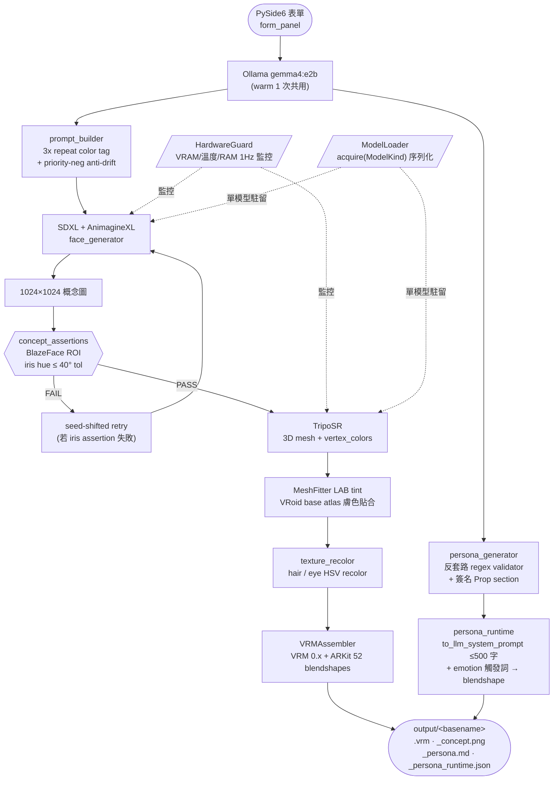

# AutoVtuber

> 自動化 VTuber 模型工作站：填一張表單 → 約 8 分鐘輸出可直接載入 VSeeFace 的 .vrm 模型。

**Author**: [@Lee-unhn](https://github.com/Lee-unhn) · a2264563@gmail.com

[](#測試)
[](#環境需求)
[](#授權)
[](#開發狀態)
[](AUTOVTUBER.md)

## 專案簡介 / Overview

AutoVtuber 把傳統 20–100 小時的 Live2D 繪製 + 綁定流程，壓縮成「填表單 → 5–10 分鐘出 `.vrm`」的全自動 pipeline。使用者透過 PySide6 GUI 輸入髮色/眼色/個性/風格/暱稱，系統依序執行 Ollama 提示生成、SDXL 1.0 + AnimagineXL 4.0 LoRA 出概念圖、TripoSR 建 3D 臉型 mesh、MeshFitter 貼合 VRoid base atlas，最後 VRMAssembler 輸出 VRM 0.x（含 hair/eye recolor + skin tone tint）+ 七章節 persona markdown + chat-ready runtime JSON。

實機跑時：RTX 3060 12GB / Ryzen 7 / 16GB RAM 約 7 分鐘（420s e2e）。

### 品質保證

無人類介入的「Reality Checker agent 三輪審計」對比 Hololive / Nijisanji EN / Vshojo 中段位 VTuber 標準：

| Round | 平均分 | 結果 | 關鍵改進 |
|---|---|---|---|
| v1 | 5.3/10 | 🔴 FAIL | iris bug、persona 套路、概念無記憶點 |
| v2 | 6.8/10 | 🟡 CONDITIONAL | iris assertion（3→8）+ 3/4 構圖 |
| **v3** | **8.0/10** | 🟢 **PASS** | 反套路 refactor + 簽名 Prop + regex validator |

所有 5 個 rubric（concept art / persona / VRM coherence / originality / production-readiness）均 ≥ 7.5。

## 架構 / Architecture



**設計原則**：
1. **3D-first**：捨棄無深度資訊的 2D-only 對齊路線
2. **One model on GPU at a time**：`ModelLoader.acquire(ModelKind)` 序列化所有重模型載入
3. **HardwareGuard 全程監控**：VRAM / GPU 溫度 / RAM / 磁碟 1Hz 輪詢，超閾值自動 abort + cleanup
4. **Fallback 不中斷 pipeline**：Ollama 不可用 → templated prompt；rembg 不可用 → 白色閾值；TripoSR 失敗 → MVP1 無 mesh tint 模式
5. **Auto-assertion + retry**：concept 與 form 眼色不符自動偵測 + 換 seed 重生一次（MVP5）
6. **反套路驗證**：persona LLM 輸出走 regex 黑名單；命中 5 個禁區 trope 之一即回 anti-trope template（MVP5）

## 技術棧 / Tech Stack

- Python 3.12，`pyproject.toml` + `requirements.txt`
- PySide6 + QtQuick3D（GUI）
- Ollama（`gemma4:e2b` 提示生成；`qwen2.5:3b` persona override）
- SDXL 1.0 + AnimagineXL 4.0 LoRA（概念圖）
- TripoSR（stabilityai 3D mesh）
- VRoid base atlas + 自製 MeshFitter（LAB tint）
- VRM 0.x 輸出，直接相容 VSeeFace / Warudo
- i18n：en_US / zh_CN / zh_TW（`assets/i18n/*.ts`）

## 主要檔案 / Key Files

- `AUTOVTUBER.md` — 完整專案規格與開發歷程（含 Reality Checker 三輪審計）
- `src/autovtuber/main.py` + `__main__.py` — 程式入口
- `src/autovtuber/pipeline/orchestrator.py` — 統籌四階段 pipeline，含 iris assertion 自動 retry
- `src/autovtuber/pipeline/prompt_builder.py` — SDXL prompt（3x tag repeat + priority-neg anti-drift）
- `src/autovtuber/pipeline/persona_generator.py` — 七章節 persona md 生成（反套路 regex validator）
- `src/autovtuber/pipeline/persona_runtime.py` — **MVP5**：persona → chat system prompt + emotion 觸發字典
- `src/autovtuber/pipeline/concept_assertions.py` — **MVP5**：BlazeFace ROI iris hue 自動斷言
- `src/autovtuber/pipeline/image_to_3d.py` — TripoSR 整合
- `src/autovtuber/pipeline/mesh_fitter.py` — VRoid base atlas LAB chroma tint
- `src/autovtuber/pipeline/vrm_assembler.py` — VRM 0.x 輸出（含 ARKit Perfect Sync 52 blendshapes）
- `src/autovtuber/safety/hardware_guard.py` / `model_loader.py` — 硬體護欄
- `scripts/smoke_test_e2e.py` / `smoke_test_e2e_avatarB.py` — 端到端 smoke test
- `scripts/render_vrm_six_views.py` — VRM 六視角驗收渲染
- `docs/architecture.md` / `docs/MVP3_PLAN.md` / `docs/HARDWARE_PROTOCOL.md` — 架構與硬體協議文件
- `assets/base_models/face_uv_template_*.json` — A/B/C 三種 VRoid base UV 模板
- `config.example.toml` — 設定範例

## 使用 / Usage

```bash
# 1. 環境（建議用 venv，pyproject.toml 會自動 bootstrap）
pip install -r requirements.txt

# 2. 複製設定
cp config.example.toml config.toml  # 編輯後填入模型路徑

# 3. 啟動 GUI
run.bat              # Windows
python -m autovtuber # 跨平台
```

輸入髮色/眼色/個性/風格/暱稱 → 按 ✨ → `output/` 目錄會出現：
- `character_<ts>_<hash>_<nickname>.vrm` — VSeeFace 可直接拖
- `_concept.png` — SDXL 概念圖
- `_persona.md` — 七章節中文人設（基本資料 / 個性 / 簽名 Prop / 背景 / 興趣 / 口頭禪 / 直播風格 / 互動方式）
- `_persona_runtime.json` — **MVP5** chat-ready 設定（≤500 字 system prompt + 中文→blendshape emotion 字典）

## License

MIT — 詳見 [`docs/LICENSES.md`](docs/LICENSES.md)。
