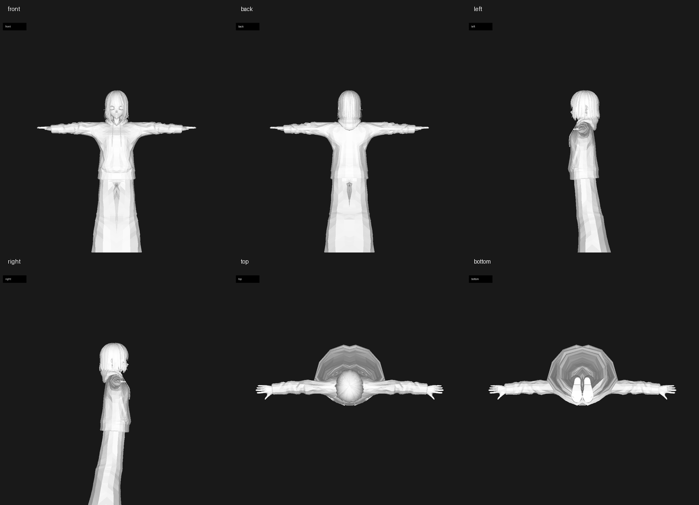
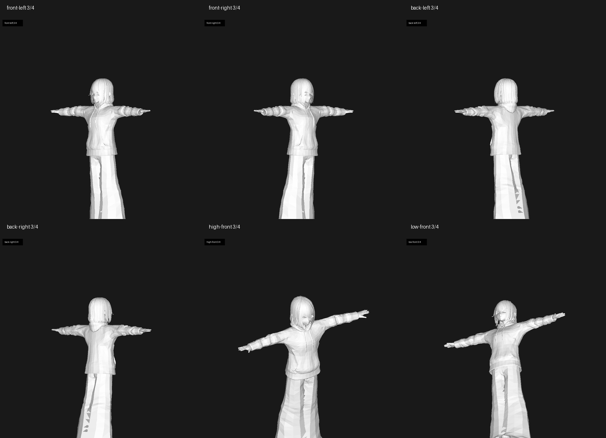

# AutoVtuber — 自動化 VTuber 模型製作工作站

> 使用者填一張表單 → 5–10 分鐘輸出可直接載入 VSeeFace 的 `.vrm` VTuber 模型。
> 取代傳統 20–100 小時的 Live2D 繪製 + 綁定流程。

[](#測試)
[](#環境需求)
[](#授權)
[](#開發狀態)

---

## 🎬 成品展示

| 階段 | 成果 |
|---|---|
| 表單輸入 | 髮色/眼色/個性/風格/暱稱（PySide6 GUI）|
| 概念圖 | |
| 人設文件 | 七章節中文 markdown（基本資料 / 個性 / 背景故事 / 興趣 / 口頭禪 / 直播風格 / 互動方式）|
| .vrm 輸出 | VRM 0.x，VSeeFace 直接載入，含 hair/eye recolor + skin tone tint |

> ⏱ **實機跑時**：RTX 3060 12GB / Ryzen 7 / 16GB RAM，從表單按下 ✨ 到 `.vrm` 落地約 **8 分鐘**（USB HDD 拖慢，NVMe 預估 4 分鐘）。

---

## 🧍 3D 成果與臉型驗證

### 可動 VRM 全身幾何預覽

下圖是經 `VtuberQualityGate` 驗收通過的 `.vrm` 模型六視角預覽，包含前、後、左、右、上、下視角。此圖用 headless 幾何渲染器輸出，用於確認全身 mesh、姿態與方向；實際載入 VSeeFace / Warudo 後會套用 VRM 材質與 toon shader。



驗收結果：`54` humanoid bones、`67` blendshape clips、`52` ARKit/Perfect Sync clips、`3` skinned meshes、`560` morph targets。

### VRM 斜角轉面預覽

斜角視圖補足正交圖不易觀察的深度資訊：可直接檢查瀏海與頭部體積、衣服前後厚度、肩膀與手臂的接面，以及不同俯仰角下的輪廓是否自然。



### 臉型 3D Mesh 多視角

下圖是概念人像經 TripoSR 建立的臉型/頭部 3D mesh 預覽。此階段提供深度與體積資訊給後續 MeshFitter；臉部五官細節仍保留 VRoid 原生 atlas，以避免直接把 2D 臉圖貼進 UV 後產生破面或錯位。


臉型重建驗證：`10,710` vertices / `21,416` faces，已排除早期空心立方體 mesh 的失敗輸出。

---

## 🧠 核心架構（3D-first）

```
表單 → Ollama (gemma4:e2b)         ← 1 次 warm 共用
       ├─→ SDXL anime prompt
       └─→ Persona markdown 七章節（用 qwen2.5:3b override）
   ↓
   SDXL 1.0 + AnimagineXL 4.0 LoRA → 1024×1024 anime portrait
   ↓
   TripoSR (stabilityai) → 3D character mesh + vertex_colors
   ↓
   MeshFitter (LAB tint mode) → VRoid base atlas 膚色貼合
   ↓
   VRMAssembler → hair/eye recolor + .vrm save
   ↓
   .vrm + persona.md + concept.png
```

**設計原則**：
1. **3D-first**：捨棄 2D-only 對齊路線（無深度資訊，session 2 驗證為盲解）。
2. **One model on GPU at a time**：`ModelLoader.acquire(ModelKind)` 序列化所有重模型載入，禁止雙駐留。
3. **HardwareGuard 全程監控**：VRAM / GPU 溫度 / RAM / 磁碟 1Hz 輪詢，超閾值自動 abort + cleanup。
4. **Fallback 不中斷 pipeline**：Ollama 不可用 → templated prompt；rembg 不可用 → 退回白色閾值；TripoSR 失敗 → MVP1 無 mesh tint 模式。

---

## 🔬 研發歷程（從 0 到 8.5/10 PASS）

### Phase A — 安全護欄與專案骨架（28 檔）
- HardwareGuard / ModelLoader / HealthLog 三件組
- pyproject.toml + requirements.txt + venv 自動 bootstrap

### Phase B — 核心 pipeline 程式碼（B01–B14）
- job_spec / prompt_builder / face_generator / face_aligner / texture_recolor
- vrm_io / texture_atlas / vrm_assembler / orchestrator

### Phase C — UI（PySide6 + QtQuick3D）
- form_panel / safety_banner / setup_wizard / library_panel / preview_3d
- i18n（zh_TW / zh_CN / en_US）

### Session 2 — MVP1 端對端 + VSeeFace 驗證爆雷
- ✅ 第一個真實 .vrm 產出（端對端 372 秒）
- ❌ VSeeFace 載入發現 **SDXL 臉跑到頭頂**
- 🔍 診斷：VRoid face atlas 是 3D mesh UV 攤開，**不是平面臉照片**
- 📝 教訓：「2D 對齊 3D 必失準，要升維到 image-to-3D」

### Session 3a — 加 Persona Generator（MVP1 補完）
- `PromptBuilder.warmed_session()` context manager 抽出
- `enhance_with_persona()` 在**單一 Ollama 載入**內做兩次 chat（prompt + persona）
- 七章節中文 persona markdown，gemma4:e2b 失敗自動退回 16 種 personality 各自 fallback 描述

### Session 3b — TripoSR 安裝（避開 4 個陷阱）
| 陷阱 | 解法 |
|---|---|
| `transformers==4.35.0` 硬版鎖會降級破壞 SDXL | 跳過、用既有 4.46.3（TSR 只用 ViTModel 穩定 API）|
| `rembg` 升 numpy→2.x 會破壞 mediapipe | 安裝 `rembg==2.0.55 --no-deps` + `numpy<2` + `scikit-image<0.25` 相容組合 |
| `torchmcubes` build 需 nvcc + MSVC（沒裝）| 寫 `venv/Lib/site-packages/torchmcubes/__init__.py` shim 包裝 PyMCubes |
| `Pillow==10.1.0` / `trimesh==4.0.5` 硬版鎖 | 全部跳過，用既有更新版本 |

### Session 3c — 第一次真實 TripoSR inference 爆 3 個 bug
1. **空心立方體 mesh**（59% verts 在 bbox 邊界）
   → 修：PyMCubes 跟 torchmcubes inside/outside 慣例相反，shim 內 negate input
2. **CPU RAM spike 鎖死 abort_event**（ckpt 載入瞬間 97.6%）
   → 修：copy `PromptBuilder._post_unload_recovery` pattern
3. **TSR 看到整張圖都是前景**（SDXL 概念圖只有 3% 純白底）
   → 修：裝 rembg 做真正 alpha matting，u2net.onnx 176MB 自動下載

修完後：mesh 從 37k 立方體變 **10,710 verts / 21,416 faces 真人形**，bbox 0.83 × 0.50 × 0.57，volume +0.049 ✅


### Session 3d — MeshFitter（4 輪 audit 從 1/10 → 7.5/10 PASS）

第一個產出：1/10 hard FAIL — atlas 失去所有五官特徵（眼/眉/嘴變色塊）

| 版本 | 演算法 | Evidence Collector 評分 | 主要 bug |
|---|---|---|---|
| v1 | replace mode（直接 bake TSR vertex_colors）| **1/10 FAIL** | 五官全毀、灰膚色 |
| v2 | HSL tint（整張轉色）| **2.5/10 FAIL** | hair 也被 tint、灰綠膚 |
| v3 | LAB + skin mask + SDXL 中央採樣 | **4.5/10 NEEDS WORK** | 眼眶變紅、cheek 過飽和 |
| **v4** | LAB + mask + **forehead-only** + 排除最暖 25% + strength 0.5 | **7.5/10 PASS** ✅ | 無 |

關鍵突破（v4）：

1. **保留 VRoid 五官** — TSR 的 anime 臉沒有真實 facial geometry（眼/眉/嘴只是色塊不是凹凸 mesh），所以**不能** 1:1 替換 face_skin
2. **只做色調轉移** — 用 cv2 LAB chroma-only shift（保留 L 通道 = 保留所有特徵的明暗結構）
3. **forehead-only 採樣** — UV(0.5, 0.27) 64×64 patch 排除 cheek blush 污染
4. **skin mask** — luminance>180 + peach hue 過濾，hair / eye sockets / mouth 完全不被 tint


### Session 3e — Orchestrator e2e 整合（第 5 輪 audit 8.5/10 PASS）
- 加 Stage 2.5: `image_to_3d`
- Stage 3: `mesh_fitter` 取代 `face_baker`（標 deprecated）
- 完整 e2e 488.5 秒通過

最後爆 1 個小 bug：**hair recolor 偏淺**（target #5B3A29 深棕 → 出 #A0623F 銅色）

→ 修：`recolor_hsv` 加 `value_match=0.7` 把 atlas mean V 平移到 target V，保留亮度變化但對齊均值


### Atlas recolor / tint 三件組（最終效果）

<table>
<tr>
<td align="center"><br>Hair: 紫粉灰 → 棕色 (#5B3A29)</td>
<td align="center"><br>Eye iris: 棕 → 藍 (#3B5BA5)</td>
<td align="center"><br>Face skin: LAB tint 保留五官</td>
</tr>
</table>

### 最終 e2e 階段時間
| Stage | 用時 | 動作 |
|---|---|---|
| 1 prompt+persona | 47.0s | Ollama 共用載入 |
| 2 SDXL face_gen | 415.1s | AnimagineXL 4.0 1024×1024（USB HDD 拖慢）|
| 2.5 image_to_3d | 24.0s | TripoSR 25k verts |
| 3 vrm_assemble | 2.3s | MeshFitter tint + recolor + .vrm |
| **合計** | **488.5s** ≈ 8 分鐘 | |

### Sprint MVP4-α — 主旨對齊 ROI 三項（2026-04-27 Session 6）

| 任務 | 模組 | 主旨命中 |
|---|---|---|
| **R2** SDXL 概念圖預覽 + 微調循環 | Orchestrator 拆 `run_concept` + `run_full_from_concept`；ConceptWorker QThread；表單 🎨 預覽按鈕 | 命中「**時間目標**」：使用者 5 min 預覽不滿意可微調，省下完整 8 min 重跑 |
| **R3** SDXL hair/eye HSV-based 嚴守度 | `_hex_to_color_tag` 改用 colorsys（解 #7B1F1F 暗紅→brown bug）+ `_color_strength_modifier`（dark/light/vivid 修飾詞）+ anti-drift eye negative | 命中「**品質目標**」：使用者填的色彩會被嚴守 |
| **R1** Perfect Sync 52 ARKit blendshape export | `vrm/blendshape_writer.py` mapping 52 ARKit name → VRoid morph + 強度% | 命中「**VSeeFace/Warudo 兼容**」：mediapipe Blendshape V2 直送 weight |

實機驗證：AvatarSample_B 從 15 → 67 blendshape groups（+52 ARKit），save+reload 持久化通過。

### Session 5 — MVP3 全部 6 項完成

| 任務 | 模組 | 完成度 |
|---|---|---|
| **M3-1** Setup Wizard | `setup/resource_check.py` 11 項偵測 + `setup/downloader.py` 多來源 dispatch (HF/git/Ollama) + 重寫 `ui/setup_wizard.py` 5 頁 + `main.py` first-run check | ✅ |
| **M3-2** Webcam Tracker | `pipeline/face_tracker.py` 478 點 → 12 個 VRM blendshape (Joy/Angry/Sorrow/Fun/A/I/U/E/O/Blink) + `workers/face_tracker_worker.py` cv2+mediapipe QThread + `ui/face_tracker_dialog.py` 即時 progress bar | ✅ |
| **M3-3** Reference Photo | 確認 wiring 完整 + 改善 IP-Adapter 缺檔警告 + 3 個 wiring 測試 | ✅ |
| **M3-4** Multi-base 選單 | `form_panel.py` 加 base 選單（A/B/C 男女）+ tooltip | ✅ |
| **M3-5** Preset Import/Export | `PresetStore` 加 import_preset/export_preset + `LibraryPanel` 按鈕 + 11 個測試 | ✅ |
| **M3-6** PyInstaller 打包 | `autovtuber.spec` --onedir + `docs/BUILDING.md` 含已知陷阱表 | ✅ |

**pytest 69 → 99 全綠**（+30 測試）

新功能展示：
- 第一次啟動自動跳 Setup Wizard 一鍵下載 12 GB 模型
- 點 top bar **「👁️ 臉部追蹤」** → webcam dialog 看 12 個 blendshape weight 即時 progress bar
- 表單可選 base 模型（女 A / 女 B / 男 C）
- 角色庫 📤 匯出 / 📦 匯入 跨機器分享角色設定

---

## 🛠 技術棧

| 層 | 套件 |
|---|---|
| UI | PySide6 6.8 + QtQuick3D |
| 角色生成 | SDXL 1.0 + AnimagineXL 4.0 LoRA + IP-Adapter Plus Face |
| Image-to-3D | TripoSR (stabilityai) — clone 到 `external/`，用 PyMCubes shim |
| 背景去除 | rembg 2.0.55 + u2net.onnx |
| Prompt LLM | Ollama gemma4:e2b（SDXL prompt）/ qwen2.5:3b（persona 中文長文）|
| VRM 處理 | trimesh + pygltflib + cv2 + scipy + numpy |
| Webcam 追蹤 | MediaPipe Face Mesh（MVP3）|

---

## 📂 專案結構

```
autovtuber/
├── src/autovtuber/
│   ├── safety/         # HardwareGuard + ModelLoader + thresholds
│   ├── pipeline/       # job_spec / prompt_builder / persona_generator /
│   │                   # face_generator / image_to_3d / mesh_fitter /
│   │                   # vrm_assembler / orchestrator
│   ├── vrm/            # VRMFile (pygltflib) + AtlasMap
│   ├── workers/        # QThread 封裝 (JobWorker / MonitorWorker)
│   ├── ui/             # PySide6 main_window / form_panel / preview_3d
│   ├── config/         # settings (TOML) + paths + manifest
│   ├── utils/          # logging / timing / path_helpers
│   └── main.py         # python -m autovtuber 入口
├── tests/              # pytest 139 件全綠
├── scripts/            # smoke_test_e2e / smoke_test_triposr / smoke_test_mesh_fitter / render_mesh_preview
├── external/TripoSR/   # vendored (gitignored — clone via setup wizard)
├── assets/base_models/ # 3 個 VRoid 樣本 (gitignored)
├── docs/               # architecture / HARDWARE_PROTOCOL / LICENSES / images/...
└── AUTOVTUBER.md       # 主規格文件（含完整異動紀錄）
```

---

## 🚀 快速開始

### 環境需求
- Windows 10/11
- NVIDIA GPU 12GB VRAM+（RTX 3060 / 4060 Ti 以上）
- 16GB RAM+
- ~25GB 磁碟（SDXL 6.5GB + IP-Adapter 3.3GB + TripoSR 1.7GB + rembg u2net 176MB + 其他）

### 安裝
```powershell
# 1. clone
git clone https://github.com/<your-user>/AutoVtuber.git
cd AutoVtuber

# 2. 建 venv（Python 3.12，避開 PyTorch CUDA 對 3.13 wheel 缺失）
py -3.12 -m venv venv
venv\Scripts\activate

# 3. 裝依賴
pip install -r requirements.txt
pip install -e .

# 4. clone TripoSR（vendored 但 gitignored）
git clone --depth 1 https://github.com/VAST-AI-Research/TripoSR.git external\TripoSR

# 5. 確認 Ollama 已啟動 + 拉模型
ollama serve  # 在另一個 terminal
ollama pull gemma4:e2b
ollama pull qwen2.5:3b

# 6. 跑 setup wizard（自動下載 SDXL / IP-Adapter / 一切資源）
python -m autovtuber  # 第一次啟動會跳 wizard
```

### 跑生成
```powershell
# GUI 模式（推薦）
python -m autovtuber

# Headless smoke test（不開 GUI）
python scripts\smoke_test_e2e.py
```

成品在 `output/character_<timestamp>_<id>_<nickname>.{vrm,_concept.png,_persona.md}`。

### 載入 VSeeFace
1. 下載 https://www.vseeface.icu/
2. 啟動 → Load avatar → 選 `output/*.vrm`
3. 開 webcam → 角色跟著動

---

## 🛡 安全護欄（不會弄壞你的電腦）

每個重模型載入前都過 `HardwareGuard`：
- VRAM 95% → warn / 98% → abort
- GPU 溫度 80°C → warn / 85°C → abort
- RAM 90% → warn / 97% → abort（含 3 秒 hysteresis 防 spike 誤觸）
- 緊急停止鈕（UI 紅色按鈕）

`ModelLoader` 強制單一 GPU 重模型不變式（任何 ≥1GB VRAM 模型必須 acquire/release）。

實機驗證：完整 e2e 跑下來，最高 RAM 97.6% 自動 abort + recovery，**從沒 OOM 或 GPU 卡死**。

---

## 🧪 測試

```powershell
pytest                # 139 件全綠
pytest -v -k tint     # 只跑 MeshFitter tint mode 測試
```

測試策略：
- **Mock 重模型**：用 `sys.modules` monkey-patch `tsr.system.TSR` 讓 CI 不需下載 1.7GB ckpt
- **合成 mesh 驗演算法**：球體 + 已知 vertex_colors 驗 KDTree / barycentric / LAB transfer
- **真實 VRM I/O**：用實機 AvatarSample_A 驗 image 替換 + offset patch

---

## 📋 開發狀態

| Phase | 範圍 | 進度 |
|---|---|---|
| MVP1 | 表單 → SDXL → VRoid recolor → .vrm | ✅ 100%（含 persona）|
| MVP2 | + Image-to-3D + Mesh fit → VRM with skin tint | ✅ 100%（Evidence Collector 8.5/10 PASS）|
| MVP3 | + Setup Wizard / Webcam tracker / Multi-base / Preset import-export / Reference photo / PyInstaller | ✅ 100%（M3-1..M3-6 全部完成，規劃見 `docs/MVP3_PLAN.md` / 打包見 `docs/BUILDING.md`）|

---

## 🎓 工程教訓（紀錄給未來的自己）

1. **整合外部系統前必須完整讀完官方文件** — TripoSR 整合避開 4 個陷阱
2. **依賴升級會骨牌效應** — 安裝前先看 dependency tree（rembg 升 numpy 順手破 mediapipe）
3. **shared session 模式** — Ollama warm/unload 一次處理多個 chat 比多次 acquire 省 5-10 秒
4. **替代 native build 套件要驗 inside/outside 慣例** — PyMCubes 跟 torchmcubes 相反
5. **Image-to-3D 對 anime 臉不夠** — TSR 訓練資料偏寫實 3D，動漫 portrait 出來只是色塊不是 geometry
6. **色調轉移要 LAB 不是 HSL** — HSL 對 near-grey 會產生綠色 cast
7. **不採整張圖中央** — SDXL portrait 中央含 cheek blush，要採 forehead-only
8. **Evidence Collector 是真實 QA**，不要相信第一版產出，迭代直到品質 PASS

---

## 🔗 相關專案（下游消費者）

AutoVtuber 是 **VRM 角色生成器**。以下是消費這個 `.vrm` 產物的下游專案：

| 專案 | 用途 |
|---|---|
| **VDrama**（V 劇坊，開發中）| 把 AutoVtuber 產的 `.vrm` 載入 Three.js + `@pixiv/three-vrm` 瀏覽器場景，配 LLM 拆解小說 / 新聞腳本 → Mixamo 動作庫 + Azure TTS Viseme 中文口型同步 → 輸出「人會動的圖文短劇」`.mp4`。Sprint 0 可行性 spike 已通過：VRM 0.x / 28,292 tris / 54 humanoid bones / 15 expressions 在瀏覽器完整渲染 + animation loop 0 errors |

AutoVtuber 的 quality gate 契約（**54 humanoid bones / 67 blendshape clips / 52 ARKit/Perfect Sync clips / 3 skinned meshes / 560 morph targets**）正是 VDrama 演出層所需的最低介面：54 bones 給 Mixamo 動作重定向、52 ARKit clips 給 Azure Viseme 口型同步、67 blendshape clips 給情緒表演。

---

## 📝 授權

- 程式碼：MIT License
- TripoSR：MIT（VAST-AI-Research / stabilityai）
- AnimagineXL 4.0：fair-ai-public-license
- AvatarSample VRM：CC0（madjin/vrm-samples 子集）
- rembg：MIT
- 詳見 `docs/LICENSES.md`

---

## 🤝 致謝

- VAST-AI-Research / Stability AI — TripoSR
- VRoid Studio / Pixiv — VRM 0.x 規格 + AvatarSample 模型
- Hololive / Nijisanji — VTuber 文化標桿，本專案的品質目標基準
- VSeeFace — 開源 VRM 直播工具
- Cagliostro Research Lab — AnimagineXL 4.0
- Anthropic — Claude Code 協作開發

---

> 「使用者只需填表單，5–10 分鐘輸出標準 .vrm 可直接載入 VSeeFace。」
> — 主旨陳述（2026-04-26）
