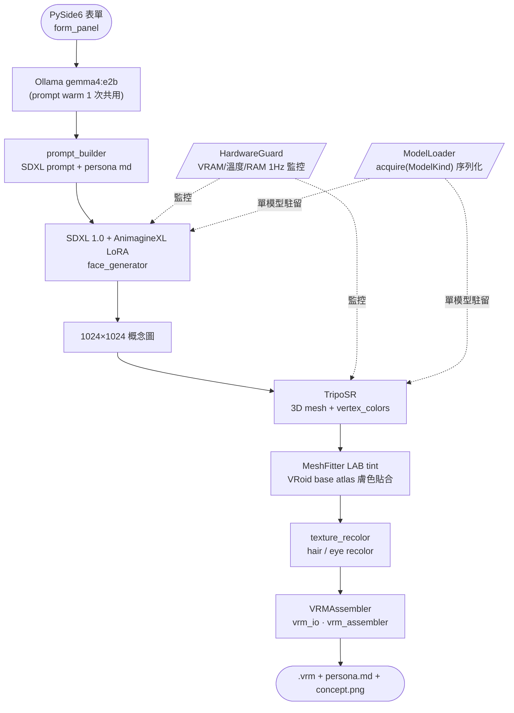

# AutoVtuber

> 自動化 VTuber 模型工作站：填一張表單 → 約 8 分鐘輸出可直接載入 VSeeFace 的 .vrm 模型。

**Author**: [@Lee-unhn](https://github.com/Lee-unhn) · a2264563@gmail.com

[](#測試)
[](#環境需求)
[](#授權)
[](#開發狀態)

## 專案簡介 / Overview

AutoVtuber 把傳統 20–100 小時的 Live2D 繪製 + 綁定流程，壓縮成「填表單 → 5–10 分鐘出 `.vrm`」的全自動 pipeline。使用者透過 PySide6 GUI 輸入髮色/眼色/個性/風格/暱稱，系統依序執行 Ollama 提示生成、SDXL 1.0 + AnimagineXL 4.0 LoRA 出概念圖、TripoSR 建 3D 臉型 mesh、MeshFitter 貼合 VRoid base atlas，最後 VRMAssembler 輸出 VRM 0.x（含 hair/eye recolor + skin tone tint）+ 七章節 persona markdown。

實機跑時：RTX 3060 12GB / Ryzen 7 / 16GB RAM 約 8 分鐘。

## 架構 / Architecture



**設計原則**：
1. **3D-first**：捨棄無深度資訊的 2D-only 對齊路線
2. **One model on GPU at a time**：`ModelLoader.acquire(ModelKind)` 序列化所有重模型載入
3. **HardwareGuard 全程監控**：VRAM / GPU 溫度 / RAM / 磁碟 1Hz 輪詢，超閾值自動 abort + cleanup
4. **Fallback 不中斷 pipeline**：Ollama 不可用 → templated prompt；rembg 不可用 → 白色閾值；TripoSR 失敗 → MVP1 無 mesh tint 模式

## 技術棧 / Tech Stack

- Python 3.12，`pyproject.toml` + `requirements.txt`
- PySide6 + QtQuick3D（GUI）
- Ollama（`gemma4:e2b` 提示生成；`qwen2.5:3b` persona override）
- SDXL 1.0 + AnimagineXL 4.0 LoRA（概念圖）
- TripoSR（stabilityai 3D mesh）
- VRoid base atlas + 自製 MeshFitter（LAB tint）
- VRM 0.x 輸出，直接相容 VSeeFace / Warudo
- i18n：en_US / zh_CN / zh_TW（`assets/i18n/*.ts`）

## 主要檔案 / Key Files

- `AUTOVTUBER.md` — 完整專案規格與開發歷程
- `src/autovtuber/main.py` + `__main__.py` — 程式入口
- `src/autovtuber/pipeline/face_aligner.py` — 臉型對齊核心
- `src/autovtuber/config/` — settings / paths / manifest
- `scripts/smoke_test_e2e.py` — 端到端 smoke test
- `scripts/render_vrm_six_views.py` — VRM 六視角驗收渲染
- `docs/architecture.md` / `docs/MVP3_PLAN.md` / `docs/HARDWARE_PROTOCOL.md` — 架構與硬體協議文件
- `assets/base_models/face_uv_template_*.json` — A/B/C 三種 VRoid base UV 模板
- `config.example.toml` — 設定範例

## 使用 / Usage

```bash
# 1. 環境（建議用 venv，pyproject.toml 會自動 bootstrap）
pip install -r requirements.txt

# 2. 複製設定
cp config.example.toml config.toml  # 編輯後填入模型路徑

# 3. 啟動 GUI
run.bat              # Windows
python -m autovtuber # 跨平台
```

輸入髮色/眼色/個性/風格/暱稱 → 按 ✨ → `output/` 目錄會出現 `.vrm` + `persona.md` + `concept.png`，可直接拖進 VSeeFace。

## License

MIT — 詳見 [`docs/LICENSES.md`](docs/LICENSES.md)。
