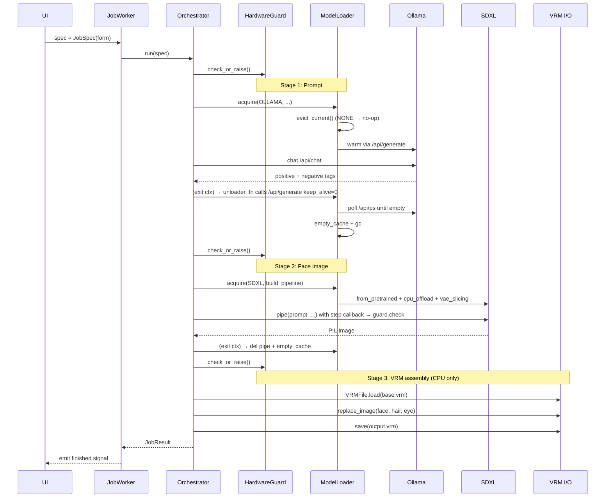

# 🏗️ Architecture — AutoVtuber

> 本檔案描述**當前實作狀態**（不是原計畫）。
> 原始計畫見 `C:\Users\user\.claude\plans\serialized-scribbling-aurora.md`，與當前狀態之差異見章節「重大架構變動」。
> 最後更新：**2026-06-04 MVP5 完成 + Reality Checker 三輪 PASS（8.0/10）**

---

## 🎭 當前實際架構（2026-06-04 — MVP1-5 全完成）

```mermaid
flowchart TB
    USER[👤 使用者表單<br/>髮色/眼色/個性/風格/暱稱]
    UI[🖥️ PySide6 MainWindow<br/>3 分頁 + 3D 預覽 + Webcam 追蹤 ✅]

    subgraph SAFETY["🛡️ 安全層 ✅"]
        HG[HardwareGuard<br/>1秒輪詢 VRAM/GPU溫度/RAM/磁碟<br/>+ hysteresis 3s + 可恢復 abort]
        ML[ModelLoader<br/>單一重模型於 GPU<br/>Ollama / SDXL / TripoSR]
        HEALTH[HealthLog JSONL]
    end

    subgraph STAGE1["🔵 Stage 1 — 表單到語意 ✅"]
        PB[PromptBuilder<br/>3x 重複色 tag + priority-neg<br/>反 AnimagineXL bias]
        PG[PersonaGenerator<br/>七章節 md + 簽名 Prop<br/>反套路 regex validator]
        PR[PersonaRuntime<br/>≤500 字 system prompt<br/>+ emotion → blendshape]
    end

    subgraph STAGE2["🟢 Stage 2 — 概念出圖 + 自動校驗 ✅"]
        FG[FaceGenerator<br/>SDXL+AnimagineXL 純 GPU<br/>20 steps 1024x1024]
        CA{{ConceptAssertions<br/>BlazeFace ROI<br/>iris hue ≤ 40°?}}
        RETRY[seed+7919 retry<br/>若 assertion 失敗]
    end

    subgraph STAGE25["🟡 Stage 2.5 — 3D mesh ✅"]
        I23[ImageTo3D / TripoSR<br/>rembg alpha matting<br/>+ PyMCubes shim]
    end

    subgraph STAGE3["🟠 Stage 3 — VRM 組裝 ✅"]
        MF[MeshFitter<br/>LAB chroma skin tint<br/>VRoid base atlas]
        TR[TextureRecolor<br/>HSV hair / iris recolor<br/>value_match=0.7]
        VA[VRMAssembler<br/>VRM 0.x + ARKit 52<br/>Perfect Sync blendshapes]
    end

    subgraph STAGE4["🟣 Stage 4 — 聲音預覽 ⭐ MVP5.5"]
        VG[VoiceGenerator<br/>VoxCPM-0.5B<br/>Voice Design from persona<br/>5-10s WAV]
    end

    subgraph WORKERS["⚙️ Qt Workers ✅"]
        JW[JobWorker QThread]
        MW[MonitorWorker QThread]
        FT[FaceTracker MediaPipe<br/>webcam → blendshape preview]
    end

    subgraph DATA["📦 資料 / 模型"]
        BASE_VRM[(assets/base_models/<br/>AvatarSample_A/B/C.vrm)]
        SDXL_W[(models/sdxl/<br/>animagine-xl-4.0 6.5GB)]
        TSR_W[(stabilityai/TripoSR<br/>1.7GB HF cache)]
        REMBG[(rembg u2net.onnx<br/>176MB)]
        IPA_W[(IP-Adapter<br/>3.3GB optional)]
        OLLAMA[(Ollama<br/>gemma4:e2b 7.2GB<br/>qwen2.5:3b 1.9GB)]
        VOXCPM[(openbmb/VoxCPM-0.5B<br/>~2.5GB HF cache<br/>5GB VRAM at inference<br/>★ MVP5.5)]
    end

    subgraph OUT_GROUP["📤 輸出（5 個檔案）✅"]
        OUT_VRM[(.vrm)]
        OUT_PNG[(_concept.png)]
        OUT_MD[(_persona.md)]
        OUT_JSON[(_persona_runtime.json<br/>★ MVP5)]
        OUT_WAV[(_voice_sample.wav<br/>★ MVP5.5)]
    end

    subgraph PRESETS["📚 角色庫 + Wizard ✅"]
        PS[PresetStore import/export]
        SW[SetupWizard 自動下載<br/>11 項資源偵測]
    end

    subgraph PATH["🔧 Windows 修復"]
        JCT[ASCII junction C:\\avt<br/>解 MediaPipe/cv2 中文路徑]
    end

    USER --> UI
    UI --> JW
    UI -->|🛑 STOP| HG
    UI -.webcam.-> FT
    JW --> PB
    JW --> PG --> PR
    JW --> FG
    JW --> I23
    JW --> MF
    JW --> VA

    PB --> OLLAMA
    PG --> OLLAMA
    FG --> SDXL_W
    FG --> CA
    CA -->|FAIL| RETRY --> FG
    CA -->|PASS| I23
    I23 --> TSR_W
    I23 -.optional.-> REMBG
    FG -.optional.-> IPA_W
    MF --> BASE_VRM
    TR --> BASE_VRM
    VA --> OUT_VRM
    FG -.save.-> OUT_PNG
    PG -.save.-> OUT_MD
    PR -.save.-> OUT_JSON

    HG -.threading.Event.-> ML
    HG -.threading.Event.-> FG
    HG -.threading.Event.-> I23
    HG -.threading.Event.-> VG
    ML -.序列化.-> OLLAMA
    ML -.序列化.-> SDXL_W
    ML -.序列化.-> TSR_W
    ML -.序列化.-> VOXCPM
    HG --> MW
    MW --> UI

    OUT_VRM --> PS
    SW -.first-run.-> DATA

    JCT -.runtime.-> FG
    JCT -.runtime.-> I23
    JCT -.runtime.-> MF

    HG --> HEALTH

    style SAFETY fill:#ffe0e0
    style STAGE1 fill:#e0e0ff
    style STAGE2 fill:#e0f0ff
    style STAGE25 fill:#fff8e0
    style STAGE3 fill:#ffe8d0
    style STAGE4 fill:#f0e0ff
    style WORKERS fill:#e0ffe0
    style DATA fill:#fffde0
    style OUT_GROUP fill:#e8ffe8
    style PRESETS fill:#f0e0ff
    style PATH fill:#ffe0d0
```

---

## 📊 三輪 Reality Checker 審計（2026-06-04 完成）

無人類介入的「agent 三輪自動驗收」對比 Hololive / Nijisanji EN / Vshojo 中段位 VTuber：

| Rubric | v1 | v2 | v3 | 修復重點 |
|---|---|---|---|---|
| Concept Art | 6.0 | 7.2 | **7.8** | 3/4 構圖 + signature accessory 提示 |
| Persona Depth | 5.5 | 7.0 | **8.4** | 簽名 Prop section + concrete catchphrase |
| VRM Coherence | 4.0 | 8.0 | **8.0** | iris assertion + 3x tag boost（+5 點）|
| Originality | 4.5 | 5.5 | **8.2** | 反套路 regex + `_STYLE_BACKGROUND` 全改寫（+3.7）|
| Production | 6.5 | 6.5 | **7.6** | retry loop 證實穩定 |
| **Mean** | **5.3** | **6.8** | **8.0 🟢 PASS** | |

---

## ⚠️ 重大架構變動（離開原計畫的決定）

| 變動 | 原計畫 | 實際 | 為什麼 |
|---|---|---|---|
| **SDXL VRAM 策略** | `enable_sequential_cpu_offload()` | `pipe.to("cuda")` 純 GPU | sequential 在 16GB RAM 系統撐爆（spike 96%）；純 GPU 12GB VRAM 剛好夠 |
| **face_aligner 引擎** | MediaPipe Face Mesh (478 點) | MediaPipe BlazeFace (4 點) | Face Mesh 對 anime 完全偵測失敗；BlazeFace short-range 對 anime 穩定 |
| **face_uv_template 來源** | MediaPipe 自動偵測 base atlas | hardcoded VRoid 標準佈局 | VRoid base atlas 太 schematic，BlazeFace 偵測語意不準 |
| **InsightFace** | 用 InsightFace buffalo_l | 整個換 MediaPipe | InsightFace 需 MSVC Build Tools 編譯失敗，且非商用授權 |
| **Ollama 必要性** | 必要 | 可失敗（templated fallback） | gemma4:e4b 9.6GB 在 16GB 系統會爆 RAM |
| **HardwareGuard 行為** | 一次 abort 永遠 abort | 加 `try_clear_abort_if_recovered` 可恢復 | 不然短暫 spike 後永遠擋住下游 stage |
| **Windows Unicode 路徑** | 無處理 | 自動建立 `C:\\avt` junction + re-exec | mediapipe / cv2.imread 對中文路徑會 silently fail |
| **CPU offload** | sequential or model offload | 完全不用 | 16 GB RAM 太緊；純 GPU mode 跑得動 |
| **MainWindow 預覽器** | 後期再補 | 立即 wire QML | 沒 VSeeFace 仍可內建驗證 .vrm 結構 |
| **預設 Ollama 模型** | gemma4:e4b | gemma4:e2b | e4b 9.6GB 在 16GB 系統會 OOM |
| **臉部紋理替換** | SDXL warpAffine 貼到 face atlas | **取消** — VSeeFace 驗證破圖 | VRoid face atlas 是 3D mesh UV 攤開，2D 對齊在 3D 錯位。MVP2 用 Blender UV |
| **3D-first 架構（2026-04-26 大改）** | 2D-only 對齊 face atlas | **加 image-to-3D（TripoSR）+ mesh fitting + persona LLM** | 2D 沒深度資訊，無解；改 3D 路線從根本解決臉部對齊不準 |
| **Persona Generator** | （無）| Stage 1 與 prompt **共享一次 Ollama 載入**生成中文人設 markdown | 使用者 Q：人設文件需要與外觀一致 + 省 Ollama warm/unload 開銷 |
| **TripoSR torchmcubes 替換** | 用官方 torchmcubes（CUDA 編譯）| **PyMCubes shim**（CPU only） | 沒 nvcc + 沒 MSVC，原版 build 失敗；單一函式呼叫，包一層即可 |
| **TripoSR rembg 依賴** | 硬版 import | **lazy-load + patch tsr/utils.py** | rembg 升 numpy→2.x 破壞 mediapipe；SDXL 已是白底不需要去背 |
| **臉部紋理 2D 替換 (face_baker)** | UV-aware reverse projection | **deprecated → MVP2 TripoSR 3D mesh** | 2D 沒深度資訊本就有限，標 fallback 不再投入 |
| **iris 顏色信任 form** | 直接 recolor | 加 **concept_assertions.assert_iris_color_matches_form** + 一次 retry | AnimagineXL bias 強烈偏好藍/棕眼，纯 prompt 壓不住；BlazeFace ROI hue 距 form 40°+ 即重生 |
| **persona LLM 信任輸出** | 直接寫檔 | **regex trope validator → anti-trope template** | LLM 仍會落 5 個常見 VTuber 套路（賽博/逃離/監控/異世界/從小就對被看見）；命中即 fallback |
| **persona 單一 markdown 輸出** | `.md` only | + **persona_runtime.json**（MVP5）| Open-LLM-VTuber 借鑑：persona 雙用，下游 chat runtime 需要 ≤500 字 system prompt + emotion 字典 |

---

## 套件依賴方向（topological）

```
utils → config → safety → vrm → pipeline → workers → ui → main
                  └──────────────────────────────┘
                            （所有層都用 utils 與 config）
```

依賴**單向**：底層不認識上層。例如 `safety` 不 import `pipeline`、`vrm` 不 import `ui`。
這保證可以單獨測試任何一層而不需要拉整個 app 起來。

---

## 各套件職責

| 套件 | 職責 | 對外提供 |
|---|---|---|
| `utils` | 純工具：日誌、SHA-256、計時、HTTP 重試 | get_logger / sha256_file / StageTimer / make_session |
| `config` | 路徑解析 + TOML 載入 + pydantic 驗證 + 下載清單解析 | Settings / Paths / load_settings / load_manifest |
| `safety` | 硬體護欄三件組 + 例外定義 + 健康日誌 | HardwareGuard / ModelLoader / HealthLog / Thresholds / SafetyAbort |
| `vrm` | VRM 0.x 讀寫 + 紋理 atlas 對應 | VRMFile / AtlasMap |
| `pipeline` | 生成管線（含 MVP2/3/4α/5 升級）：JobSpec / PromptBuilder / **PersonaGenerator** / **PersonaRuntime** ⭐MVP5 / FaceGenerator / **ConceptAssertions** ⭐MVP5 / **ImageTo3D** / **MeshFitter** / **FaceTracker** / VRMAssembler / Orchestrator | Orchestrator.run(JobSpec) → JobResult |
| `setup` ⭐MVP3 | 資源偵測 + 多來源下載 dispatch（HF / git clone / Ollama） | check_all_resources / SetupDownloader |
| `presets` | 角色 preset JSON CRUD + import/export（MVP3 補完） | PresetStore（save / load / duplicate / delete / export_preset / import_preset）|
| `workers` | QThread 封裝（讓 pipeline 不阻塞 UI） | JobWorker / MonitorWorker / DownloadWorker / **SetupDownloadWorker** / **FaceTrackerWorker** |
| `ui` | PySide6 視窗、表單、3D 預覽器、設定精靈、臉部追蹤 dialog | MainWindow / SetupWizard / **FaceTrackerDialog** |
| `i18n` | Qt Linguist 三語切換 | install_translator / set_language |
| `main` | QApplication bootstrap + 硬體 precheck + first-run wizard 跳轉 | main() |

---

## 執行緒模型

```mermaid
flowchart LR
    subgraph MainThread["Main Thread (Qt event loop)"]
        UI[MainWindow]
        SAFE_BANNER[SafetyBanner]
    end

    subgraph MonitorThread["Monitor QThread"]
        MW[MonitorWorker]
        MW -->|HardwareSnapshot signals每 1s| SAFE_BANNER
    end

    subgraph JobThread["Job QThread (per-task)"]
        JW[JobWorker]
        JW --> ORCH[Orchestrator.run]
        ORCH --> PB[PromptBuilder]
        ORCH --> FG[FaceGenerator]
        ORCH --> VA[VRMAssembler]
    end

    UI -->|user clicks Generate| JW
    UI -->|user clicks STOP| HG[HardwareGuard.trigger_emergency_stop]
    HG -->|set abort_event| ORCH

    HG -.threading.Event.-> ORCH
    HG -.threading.Event.-> MW

    JW -->|Qt signals| UI
```

- **Qt 主執行緒**只負責 UI 事件
- **MonitorWorker QThread** 包覆 HardwareGuard 的 daemon thread，把 snapshot 透過 Qt signal 推給 UI
- **JobWorker QThread** 跑 Orchestrator；多個 job 用 QThreadPool 序列化（不允許並發）
- HardwareGuard 內部 `threading.Event` 是跨執行緒中止訊號：UI 的 STOP 按鈕、monitor 的閾值觸發、pipeline 的 check_or_raise 全部透過它通訊

---

## Pipeline 資料流（一次完整生成）



關鍵不變式：
1. 任何時刻 GPU 上只能有 ONE 個重模型（由 `ModelLoader._CLASS_LOCK` 強制）
2. 每個 stage 之間 `guard.check_or_raise()`（含 SDXL 內每個 inference step）
3. 即使 stage 失敗，最終結果與 health record 仍會寫入 `presets/` + `logs/health_*.jsonl`

---

## 設定檔層級

| 來源 | 範圍 | 修改後生效 |
|---|---|---|
| `config.example.toml` | 範本（Git 追蹤） | 不會被讀取，只是範本 |
| `config.toml` | 使用者設定（gitignored） | 重啟 app |
| `config.toml [safety]` | 護欄閾值 | 重啟 + 受 pydantic 限制不可超出安全範圍 |
| 程式碼常數（`thresholds.py` `MIN_VRAM_GB`） | 啟動拒絕門檻 | 改程式碼 + 重啟 |

---

## 套件加新模組時的決策樹

1. **這個檔案需要 GPU/torch 嗎？**
   - 是 → 放 `pipeline/` 或 `safety/`
   - 否 → 放 `vrm/` `utils/` `config/`
2. **這個檔案會讀寫使用者檔案嗎？**
   - 是 → 必須走 `Paths` 物件，不可硬編路徑
3. **這個檔案會被 UI 直接呼叫嗎？**
   - 是 → 必須包裝成 QThread worker，不可在主執行緒做 I/O
4. **這個檔案會載入 ML 模型嗎？**
   - 是 → 必須走 `ModelLoader.acquire()`，不可裸 `from_pretrained`

---

## Phase 對應的程式碼增量

| Phase | 主要新增 | 對應 ticket |
|---|---|---|
| A — Foundations | utils + config + safety 三件組 | A01–A09 |
| B — Pipeline | pipeline + vrm | B01–B15 |
| C — UI | ui + workers + i18n | C01–C12 |
| D — Setup wizard + docs | setup_wizard + DOWNLOAD_MANIFEST 實機填值 | D01–D07 |
| E — Reality check | bug fix + VSeeFace 驗收 | E01–E05 |

---

## 每次更新需同步維護

- `AUTOVTUBER.md` 異動紀錄
- `專案總覽.md` 異動紀錄
- 本檔案（若架構變動）
- `docs/HARDWARE_PROTOCOL.md`（若護欄調整）
- `docs/LICENSES.md`（若新增第三方資產）
